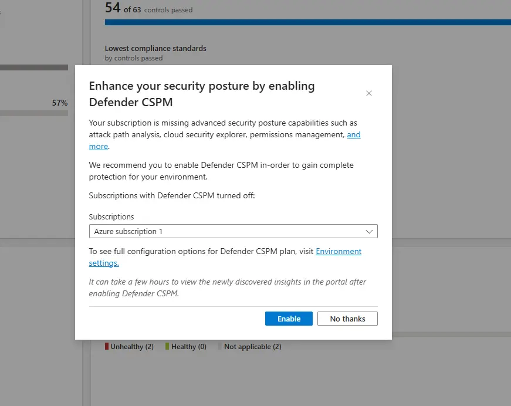
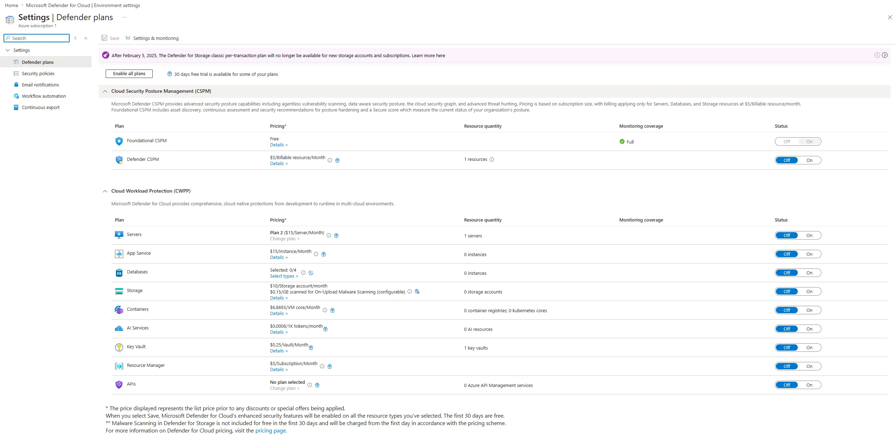
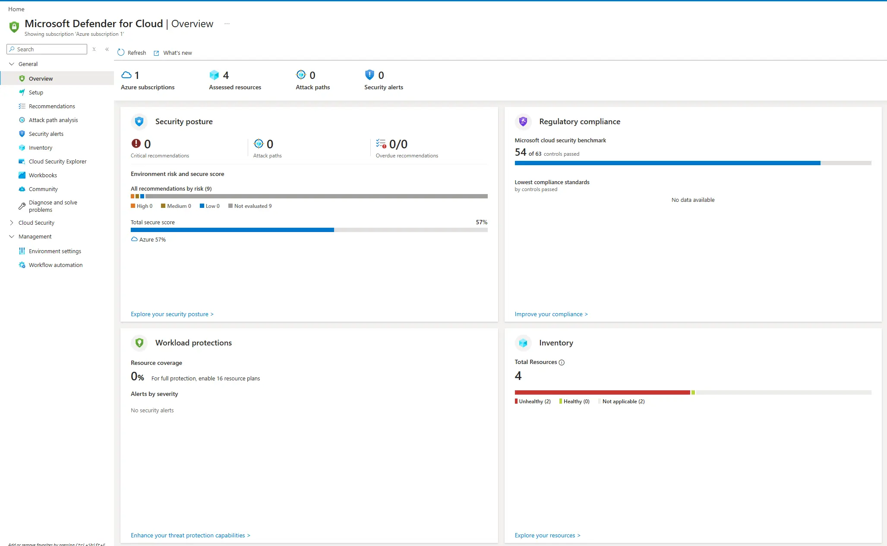
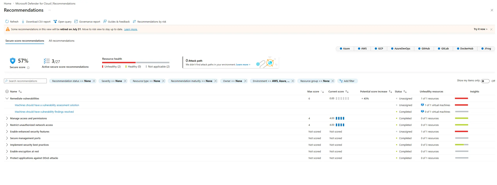
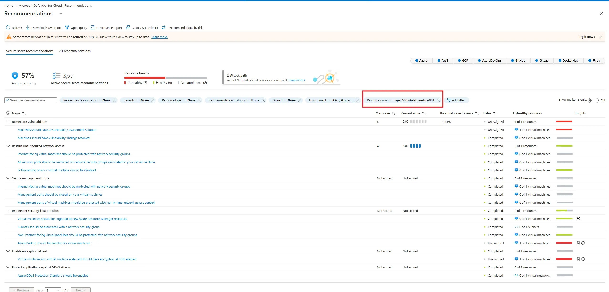
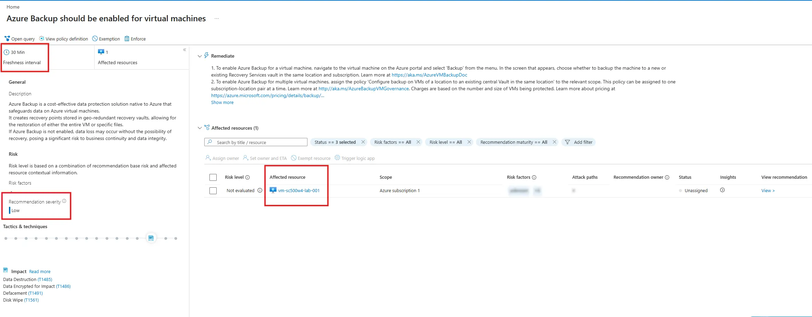
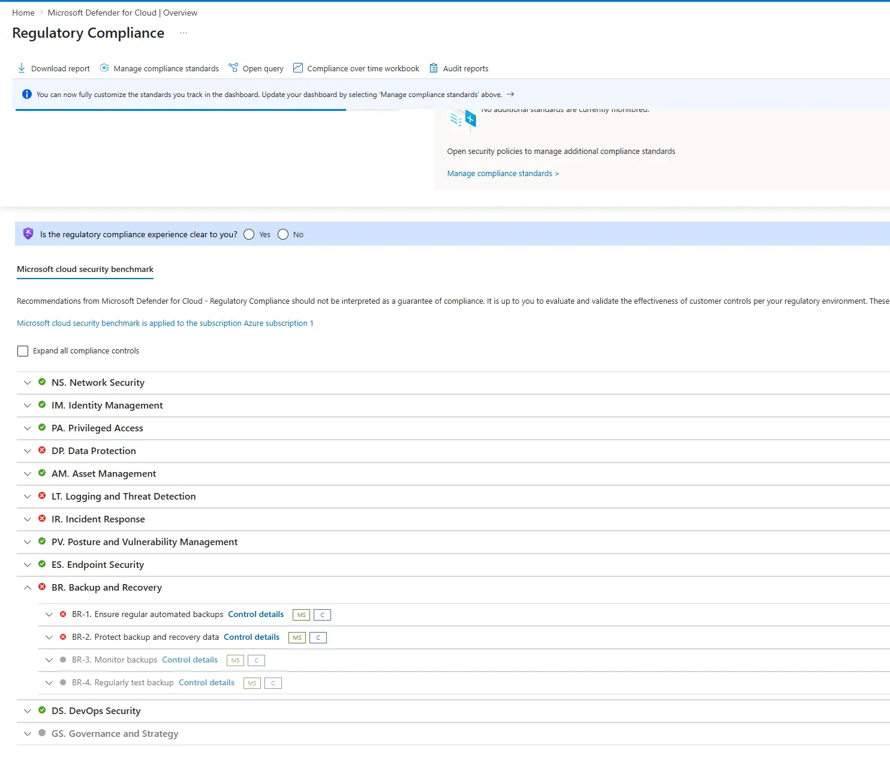

+++
title = "Defender for Cloud: What the Free Tier Actually Gives You"
date = 2026-07-29T20:40:00-04:00
draft = false
description = "Read a month of lab resources back through free foundational CSPM: confirm no paid plan is on, find the recommendations your own choices produced, and trace one down to the Azure Policy definition behind it."
tags = ["azure", "defender-for-cloud", "cspm", "secure-score", "azure-policy", "sc-500"]
categories = ["labs"]
aliases = ["/writeups/labs/defender-for-cloud-free-tier-review/"]
+++

Part of my SC-500 study series: hands-on labs in a test tenant, one concept at a time.

**Goal:** Read the month's lab resources back through Defender for Cloud's free foundational CSPM. Confirm no paid plan is on, find the recommendations my own deliberate choices produced, and trace one of them down to the Azure Policy definition that generates it.

> **Prerequisite environment:** this lab assesses the resources from [Secretless VM: Managed Identity, Bastion, and Key Vault](). Leave that resource group deployed until the end. This lab creates nothing of its own, and the VM can stay deallocated, because Defender assesses configuration rather than runtime.

> **Do not turn on a Defender plan.** Every plan offers a 30-day trial, and the trial clock is per-subscription and per-plan. Turning one on now burns it. Everything in this lab is free.

## Why this matters

The previous labs built resources by hand, making some choices for security (no public IP, no inbound rules) and others for convenience (no backup, default disk encryption). Defender for Cloud sorts them into passing and failing without being told any of it. That is the whole CSPM loop: continuous assessment against a standard, then recommendations, then a secure score.

## Prerequisites

- The Week 4 resource group still deployed (`rg-sc500w4-lab-eastus-001`)
- **Security Reader** at minimum, or **Security Admin** / Owner to change plan settings
- `Microsoft.Security` registered on the subscription, which happens automatically on first visit to the blade

## Step 1 - Decline the upsell

Opening the Defender for Cloud blade pops a modal offering to enable Defender CSPM. Choose **No thanks**.



**Enable** starts the paid plan's 30-day trial on the subscription named in the dropdown. The capabilities it advertises (attack path analysis, cloud security explorer, permissions management) are the paid half by definition. The free half is already running, which is why there is a secure score and a populated compliance dashboard behind the dialog.

Variations of the same offer recur elsewhere in the blade, including an "Enable all plans" prompt in Environment settings. Decline all of them.

## Step 2 - Confirm you are on the free tier

**Management** → **Environment settings** → expand the tenant → the subscription → **Defender plans**.

Every plan row should read **Off** except **Foundational CSPM**, which is **On**, free, and cannot be turned off. This is where you confirm Step 1 actually held.



```bash
az security pricing list --query "value[].{plan:name, tier:properties.pricingTier}" -o table
```

Everything should show `Free`. `Standard` on any row means a plan or its trial is live, and it turns off from the same blade.

> **Foundational CSPM is not a thing you enable.** It applies to every Azure subscription the moment Defender for Cloud is first opened, and assigns the Microsoft cloud security benchmark (MCSB) as the default security standard. Assessment starts from that point, so a brand-new subscription has an empty dashboard for the first few hours.

## Step 3 - Read the secure score

**Overview** → the **Secure score** tile → **Security posture**.

The score is a percentage per subscription, aggregating up through management groups. Only built-in MCSB recommendations count toward it. Custom and preview recommendations do not.



**Recommendations** → **Secure score recommendations** shows the breakdown by *security control*, which is where the math lives. Leave the filters cleared here, because the score is calculated per subscription and a resource group filter changes the list without changing the number:

| Column | Meaning |
|---|---|
| Max score | Fixed weight of the control, its relative importance, identical in every tenant |
| Current score | `(Max score / total resources) x healthy resources` |
| Potential score increase | Same formula against the *unhealthy* count |



Add up the scored controls in this unfiltered view and the tile's percentage falls out of them. This subscription has `Remediate vulnerabilities` at 0 of 6, `Manage access and permissions` at 4 of 4, and `Restrict unauthorized network access` at 4 of 4: a max of 14 and a current of 8, so 8 / 14 = 57%, and the one empty control's 6 / 14 = +43% is the potential increase beside it. Do this arithmetic once on your own numbers, because it is the whole scoring model.

Partial credit exists per resource, but a control only reaches its max when every resource satisfies every recommendation inside it. The heaviest controls are **Enable MFA** (10) and **Secure management ports** (8). **Enable auditing and logging** is worth 1, and **Implement security best practices** is worth 0, advisory only, and never moves the score.

Controls reading **Not scored** are either worth 0 by design or contain nothing that currently counts in your environment. Preview recommendations and plan-gated ones are excluded. They drop out of the denominator entirely, which is why a small subscription is scored against 14 points rather than the full weight table.

> **The free tier has a ceiling.** `Remediate vulnerabilities` stays at 0 because *Machines should have a vulnerability assessment solution* requires Defender for Servers. A single unfixable control can hold a third of the score hostage, and the only remediation is a paid plan. That is worth sitting with, because it is how posture scoring drives purchasing decisions, and the exam's "how do you improve secure score" answers assume the plans are on.

> **Two different secure scores now exist.** The classic weighted-control score above lives in the Azure portal. The Microsoft Defender portal shows a newer risk-based Cloud secure score that factors in asset criticality and internet exposure: different model, different number, not comparable. SC-500 questions about control weights mean the classic one. In the Defender portal, **Recommendations** → **Switch to classic view** gets you back to this model while it lasts.

## Step 4 - Find your own resources in the recommendations

**Recommendations**, filtered by resource group `rg-sc500w4-lab-eastus-001`.

**Secure score recommendations** groups by control and shows only what carries score weight. **All recommendations** is the flat superset, sorted by severity and with an **Initiatives** column.



Three rows come back **Unhealthy**:

| Unhealthy recommendation | What I did |
|---|---|
| Machines should have a vulnerability assessment solution | Requires Defender for Servers, unfixable on the free tier |
| Azure Backup should be enabled for virtual machines | The lab was read-level only, so no vault and no policy |
| Virtual machines and scale sets should have encryption at host enabled | Accepted platform-managed disk encryption at create time |

Everything else in the group passes, including the four rows under `Restrict unauthorized network access`: internet-facing VMs protected by NSGs, network ports restricted, management ports closed, management ports protected by just-in-time. All four pass because the VM has no public IP and no inbound rules, which is the secretless design being graded from the outside. `Secure management ports`, normally an 8-point control, reads **Not scored** for the same reason.

The **Initiatives** column reads `ASC Default` on every row: the MCSB policy initiative under its internal name, which is Step 5's point visible from the list.

> **Only assessed resources appear.** The report covers the VM, the VNet, and a subnet. **Resource health** counts four resources, though the group also holds a Key Vault, a workspace, a NAT gateway, and a public IP. A resource that has not been discovered and evaluated yet produces no rows in either direction. Confirm what is actually being assessed in **Inventory** rather than reading an absent resource as a clean one.

## Step 5 - Trace a recommendation to its policy definition

Open **Azure Backup should be enabled for virtual machines**. The detail page gives the description, a **Freshness interval** of 30 minutes, **Recommendation severity** Low, written remediation steps, and the affected resource.



Freshness interval is per recommendation, not global. This one re-evaluates every 30 minutes and others run on much longer cycles, which is why the recommendations under a control and the control itself disagree so often.

The part worth internalizing is the **View policy definition** link at the top. It opens the Azure Policy built-in definition that produces this assessment, the same engine as the `Deny` policy from [Custom RBAC Role + Azure Policy + Resource Lock](). Defender's recommendations *are* policy evaluations, and MCSB is a policy initiative assigned to your subscription.

That relationship is also what the toolbar is made of. This recommendation offers **Open query**, **View policy definition**, **Exemption**, and **Enforce**:

| Action | What it does |
|---|---|
| Enforce | Assigns the underlying policy with its `DeployIfNotExists` effect, so future VMs get backup configured automatically |
| Exemption | Excludes a resource or scope from the assessment, with a waiver or mitigation reason, so it stops counting against the score |
| Open query | Sends the assessment to Azure Resource Graph as a KQL query: the same data, queryable |

Which buttons appear depends on the policy behind the recommendation, not on the recommendation being important. **Fix** shows up only where a one-click remediation exists for already-deployed resources, and backup has none, since creating a Recovery Services vault and policy is a deployment rather than a property flip. **Deny** shows up only where the check is a resource property evaluable at creation time, and you cannot deny a VM for lacking a backup that is configured afterward. `Enforce` and `Deny` are the two preventive options, and this recommendation can only offer the first.

Read the toolbar, but do not click Enforce: a policy assignment outlives the resource group you delete at the end.

Also note **Risk level** on the affected resource: **Not evaluated**. Risk-based prioritization is a Defender CSPM feature, a second place where the paid boundary shows up in the UI rather than the docs.

## Step 6 - Regulatory compliance and MCSB

**Defender for Cloud** → **Regulatory compliance**.

MCSB is present and free. Expand any failing control to see which assessments roll up into it, and note the control ID, since every MCSB control is prefixed with its family.



Control families to recognize on the exam: **IM** identity management, **PA** privileged access, **DP** data protection, **NS** network security, **LT** logging and threat detection, **AM** asset management, **BR** backup and recovery, **IR** incident response, **PV** posture and vulnerability management.

Adding any other standard (PCI DSS, ISO 27001, CIS, NIST SP 800-53) requires the paid Defender CSPM plan. The **Manage compliance standards** button is there; the standards behind it are not free. MCSB alone is the free tier's compliance view.

## Step 7 - Teardown

Delete the Week 4 resource group. The Log Analytics workspace from the previous lab lives inside it and goes with it, so move it to another group first if you want to keep it.

```bash
az group delete -n rg-sc500w4-lab-eastus-001 --yes --no-wait
```

Recommendations for the deleted resources disappear on the next assessment cycle rather than immediately, and the score moves with them.

> **Nothing changes right away.** Each security control is recalculated every eight hours per subscription, while each recommendation underneath it runs on its own freshness interval: 30 minutes for the backup one above, considerably longer for others. That is why the resource counts on a control and on its recommendations routinely disagree. "I fixed it and the score didn't move" is almost always this, not a failure.

## Key takeaways

- Foundational CSPM is free, always on, and cannot be disabled: asset inventory, MCSB assessment, recommendations, secure score. The paid halves are Defender CSPM (attack paths, extra compliance standards, custom recommendations) and the per-workload Defender for X plans (threat detection).
- Secure score is per-control weights, not per-recommendation. Fixing one resource in an eight-point control moves the number slightly; the control only maxes out when every resource in it is healthy.
- Recommendations are Azure Policy evaluations wearing a different UI. MCSB is an initiative assigned to the subscription, and the recommendations list names it in the **Initiatives** column as `ASC Default`.
- A resource with no recommendations may be compliant or may simply not have been assessed yet. Check the resource health counts and Inventory before reading silence as safety.
- Fix repairs what exists; Enforce and Deny change what happens next. Which of the three a recommendation offers depends on its policy: Fix needs a one-click remediation, Deny needs a property checkable at creation time, Enforce needs a `DeployIfNotExists` effect. A recommendation with only Enforce is normal.
- The free regulatory compliance dashboard shows MCSB only. Every other framework is a Defender CSPM feature.
- The classic Azure-portal secure score and the Defender-portal risk-based Cloud secure score are separate models. Do not compare the numbers.

## Related labs

- [Secretless VM: Managed Identity, Bastion, and Key Vault]() built the resources this lab assesses
- [Custom RBAC Role + Azure Policy + Resource Lock]() is the policy engine underneath every recommendation
- [Lock Down a Storage Account End-to-End]() covers most of the storage recommendations you will see
