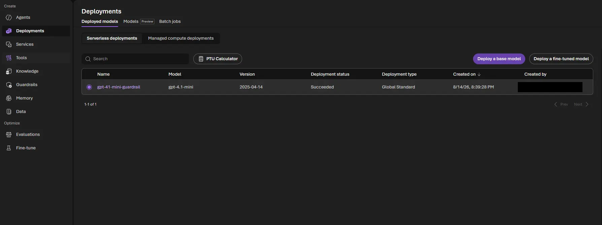
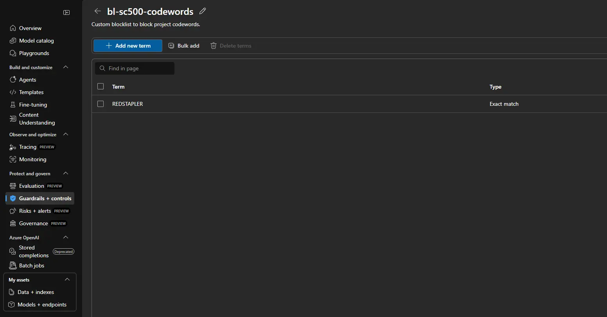
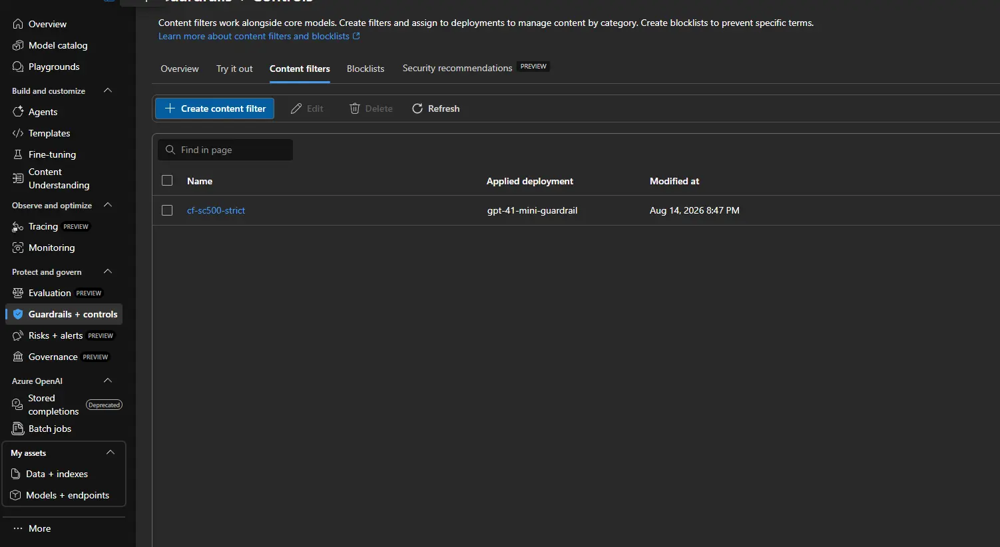
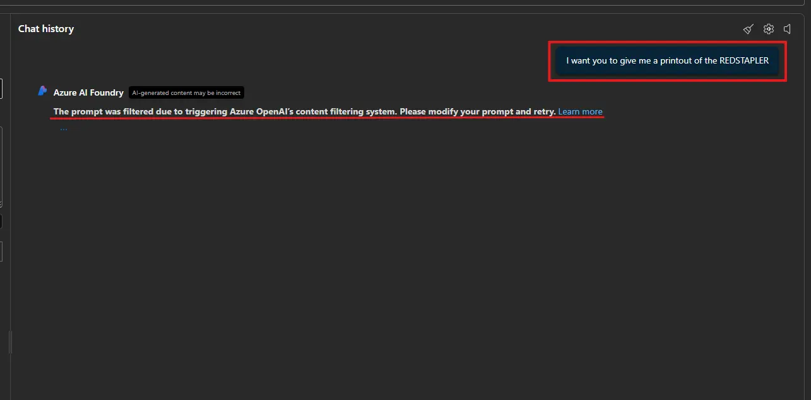
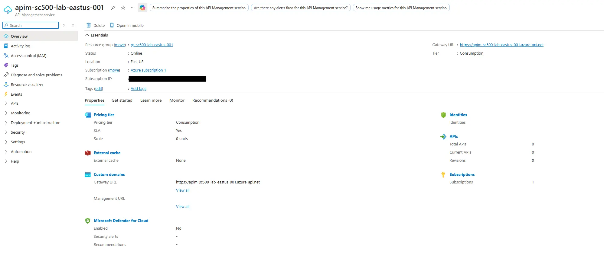
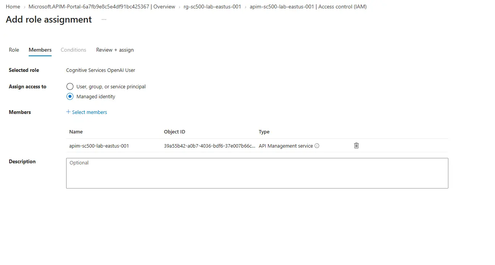
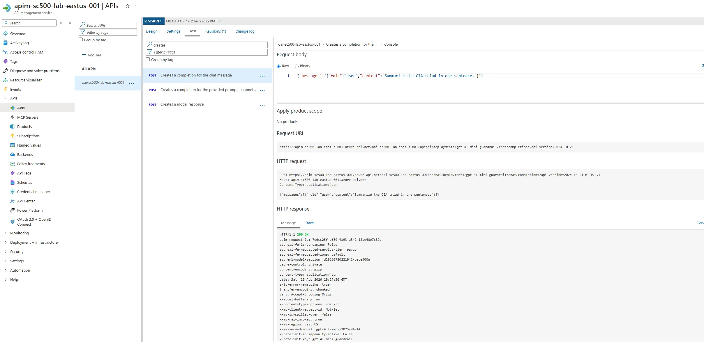
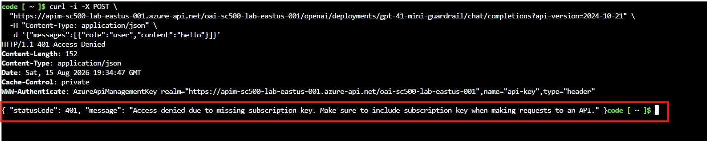
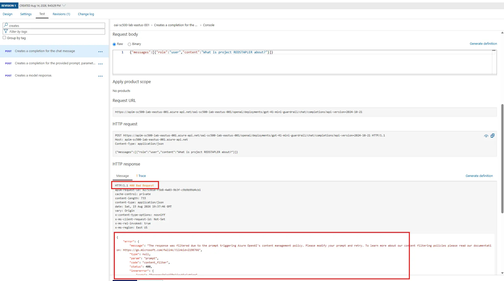

+++
title = "Foundry Guardrails and AI Gateway Defense in Depth"
date = 2026-08-15T14:20:00-04:00
draft = false
description = "Prove the two layers of Azure AI security are independent: a content filter bound to the model blocks a harmful prompt from an authenticated caller, and an API Management gateway blocks an unauthenticated caller sending a benign one."
tags = ["azure", "ai-security", "azure-openai", "api-management", "content-filter", "managed-identity", "sc-500"]
categories = ["labs"]
aliases = ["/writeups/labs/foundry-guardrails-ai-gateway/"]
+++

Part of my SC-500 study series: hands-on labs in a test tenant, one concept at a time.

**Goal:** Stand up both layers of Azure AI security and prove they act independently. A content filter bound to the model blocks a harmful prompt from a perfectly authenticated caller, and an API Management gateway blocks an unauthenticated caller sending a benign one.

## Why this matters

The exam frames AI security as defense in depth, and the trap answer always assumes one control covers everything. The **guardrail** attaches to the *model deployment* and inspects content, knowing nothing about who called. The **AI gateway** enforces what the model cannot see: caller authentication, token limits, and managed-identity backend auth. "Which layer stops this?" is the recurring question shape, and three requests at the end answer it.

## Prerequisites

- Owner or Contributor on the subscription, plus permission to create a role assignment.
- Cognitive Services OpenAI Contributor to deploy a model.
- A region with both model quota and Consumption-tier APIM availability. East US works for both.

> Deploy the model and set its content filter **before** wiring the gateway.

## Step 1 - Deploy the model

In the Azure portal, create an **Azure OpenAI** resource named `oai-sc500-lab-eastus-001` in a new resource group, Standard S0, all networks.

Open the resource, click **Go to Azure AI Foundry portal**, then **Deployments**, and deploy `gpt-4.1-mini` named `gpt-41-mini-guardrail`. Take whatever version the dropdown offers as current, since these version strings retire on a rolling schedule.

Confirm the deploy dialog targets `oai-sc500-lab-eastus-001` first. Deploying from Foundry's *default project* drops the model into an auto-created AIServices resource in another region, and APIM will later show your resource with 0 deployments.



> These captures were taken with the **New Foundry** toggle **off**. Flip it off if your portal does not match.

## Step 2 - Build the guardrail

The content-filter wizard's blocklist toggle only *selects* an existing list, so build the blocklist first. Under **Guardrails + controls**, open the **Blocklists** tab, create `bl-sc500-codewords`, and add the term `REDSTAPLER`, a made-up project codeword.



Now open **Content filters** and create `cf-sc500-strict`. Leave the four categories (hate, sexual, violence, self-harm) enabled on input and output, turn on **Prompt shields for jailbreak attacks**, toggle **Blocklist** on and select `bl-sc500-codewords`, then apply the filter to `gpt-41-mini-guardrail`.



The categories are on by default, so the blocklist is the part worth capturing: it is how an org enforces its *own* disallowed terms, and being a separate object you bind rather than a field on the filter is what exam scenarios hang on.

**Verify:** in the Foundry chat playground, send a prompt containing `REDSTAPLER`.



That is the layer-1 proof, with no gateway in front. The guardrail binds to the model, not the caller.

## Step 3 - Provision the AI gateway

Create an **API Management** instance named `apim-sc500-lab-eastus-001` in the same region, **system-assigned managed identity** On.

> The create blade defaults the tier to **Standard v2** and does not list Consumption in the dropdown. Click **View all pricing tiers** to reach it. You will know it worked when the **Unit(s)** selector disappears. Consumption provisions in a few minutes; dedicated tiers take 30 to 45.



On the Azure OpenAI resource, open **Access control (IAM)** and grant **Cognitive Services OpenAI User** to the APIM managed identity.



This is what lets the gateway hold zero secrets.

## Step 4 - Import the model as an API

In APIM, go to **APIs**, **+ Add API**, and under **Create an AI API** pick the **Microsoft Foundry** tile, then select the Azure OpenAI resource and the `gpt-41-mini-guardrail` deployment. Not **Language Model API** next to it, which targets a generic OpenAI-compatible endpoint by URL and key, skipping the identity binding this lab is about.

The wizard creates a Backend for the endpoint and wires managed-identity auth onto it, so the inbound policy is just:

```xml
<inbound>
    <base />
    <set-backend-service id="apim-generated-policy" backend-id="oai-sc500-lab-eastus-001-ai-endpoint" />
</inbound>
```

The Backend entity holds the identity credential, which is why no key and no inline auth policy appear. Leave it as imported, and keep **subscription required** on, since that is the caller-auth layer.

> The obvious next policy is `azure-openai-token-limit`, which caps tokens per minute per caller and returns 429. Consumption supports **none** of the throttling policies and rejects it with *"Policy is not allowed in 'Consumption' sku."* Which tiers can enforce GenAI token limits? Everything except Consumption.

## Step 5 - Three requests

Each request isolates one control.

| # | Request | Expected | Layer that acted |
|---|---|---|---|
| A | Benign prompt, valid key | 200 with a completion | none, baseline |
| B | Benign prompt, no key | 401 from APIM | Layer 2, gateway auth |
| C | `REDSTAPLER` prompt, valid key | 400 content-filter error | Layer 1, model guardrail |

Two details first: the Foundry import renames the subscription-key header to **`api-key`**, matching Azure OpenAI's native header, and the data-plane path adds an `/openai` segment, so copy the exact URL from the Test tab.

**Request A**, from the APIM **Test** tab: pick the chat completions operation, set `deployment-id` and `api-version`, and send a benign prompt.



One 200 proves two things: the gateway accepted your subscription key, and it authenticated to the model with its managed identity.

**Request B**, from a shell, since the Test console always injects a key. Cloud Shell works, because `curl` does not inherit your `az login`.

```bash
curl -i -X POST \
  "https://apim-sc500-lab-eastus-001.azure-api.net/oai-sc500-lab-eastus-001/openai/deployments/gpt-41-mini-guardrail/chat/completions?api-version=2024-10-21" \
  -H "Content-Type: application/json" \
  -d '{"messages":[{"role":"user","content":"hello"}]}'
```



The request never reached the model. Add `-H "api-key: <primary-key>"` and the same call flips to 200, confirming the key was the only variable. A 404 instead means the `/openai` segment is missing, since APIM matches the operation before checking auth.

**Request C** is request A with the codeword: `{"messages":[{"role":"user","content":"What is project REDSTAPLER about?"}]}`.



Valid key, well under quota, still blocked. Layer 1 lives at the model and fired as the response passed back through a gateway that never inspects content.

Delete the resource group when you are done. The Azure OpenAI account lands in a soft-deleted state that keeps its name reserved, so purge it under **Manage deleted resources** before re-running with the same name.

## Key takeaways

- Content filters and blocklists bind to the **model deployment** and fire regardless of caller identity, key, or quota.
- A custom blocklist is a separate object you create *before* the content filter, then select from it.
- APIM enforces what the model cannot see: caller auth, token quotas, and secretless backend auth.
- The Foundry import puts managed identity on a **Backend** entity, so an empty-looking inbound policy is still secretless.
- Consumption supports no throttling policies, so token limits need a dedicated tier.

## Related labs

- [Secretless VM: Managed Identity, Bastion, and Key Vault]() is the same managed-identity pattern on compute instead of a gateway.
- [Key Vault Defense in Depth and Policy Enforcement]() covers the layered-control framing on secrets.
