+++
title = "Key Vault Defense in Depth and Policy Enforcement"
date = 2026-08-02T11:30:00-04:00
draft = false
description = "Three independent ways a Key Vault secret read can be refused: control-plane RBAC, data-plane RBAC, and the vault firewall. Then a custom Azure Policy that stops a badly configured vault from being created at all."
tags = ["azure", "key-vault", "azure-policy", "private-endpoint", "rbac", "sc-500"]
categories = ["labs"]
aliases = ["/writeups/labs/key-vault-defense-in-depth/"]
+++

Part of my SC-500 study series: hands-on labs in a test tenant, one concept at a time.

**Goal:** See the three independent ways access to a Key Vault secret can be refused, and tell them apart from the error alone:

| Layer | What it governs | Does `Owner` get it? |
|---|---|---|
| Control-plane RBAC | The vault as a resource: create, delete, read properties | Yes |
| Data-plane RBAC | The secrets inside it | **No** |
| Vault firewall | Where the request came from, checked before either | Irrelevant |

Then write a custom Azure Policy that stops a badly configured vault from being created at all.

## Prerequisites

- Owner, or Contributor plus User Access Administrator, on the subscription
- Permission to create policy definitions at subscription scope

> **Purge protection is a one-way door.** It cannot be disabled once enabled, which is the point of the control and also a consequence for this lab: when you delete the resource group at the end, the vaults enter soft-delete for the retention period and **cannot be purged early**. Their names stay reserved. Plan for it now rather than during teardown. (Soft delete itself is no longer optional at all. If a training module tells you to enable it, that instruction is stale.)

## Step 1 - A hardened vault

Create `kv-sc500wk5-dev-eus-01` with **purge protection enabled**, 7-day retention, and permission model **Azure role-based access control** rather than vault access policies. Leave public access on; Step 3 locks it.

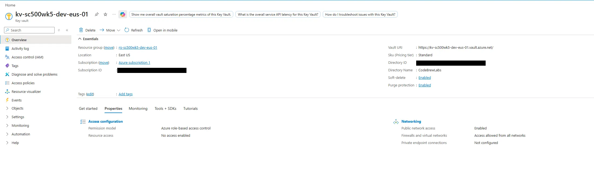

The permission model is the deliberate contrast with the access-policy model. Everything below behaves differently because of this one choice.

```bash
az keyvault show --name kv-sc500wk5-dev-eus-01 --resource-group rg-sc500wk5-dev-eus-01 --query "{purge:properties.enablePurgeProtection, rbac:properties.enableRbacAuthorization, softDelete:properties.enableSoftDelete}"
```

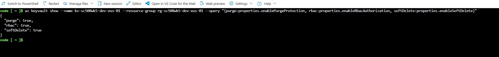

All three return `true`, and you never asked for soft delete.

## Step 2 - Prove Owner cannot read a secret

Do this **before** granting yourself anything. It is the highest-value moment in the lab. As subscription Owner with no data-plane role, creating a secret fails:

```bash
az keyvault secret set --vault-name kv-sc500wk5-dev-eus-01 --name demo-secret --value "hello-sc500"
```

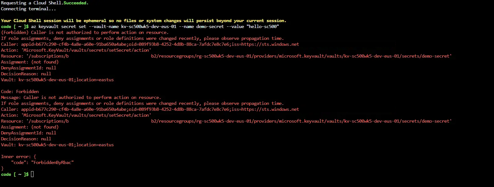

Now assign yourself **Key Vault Secrets Officer** on the vault.

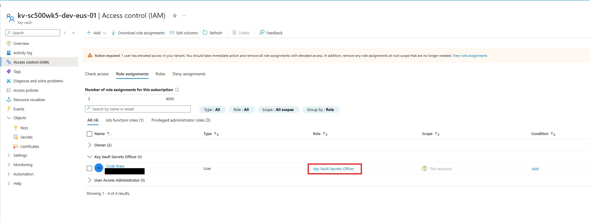

> **Secrets Officer versus Secrets User.** Secrets User is read-only. Writing needs Secrets Officer. Getting this pair backwards is a classic exam distractor.

Wait a minute or two for propagation and retry. It now succeeds.

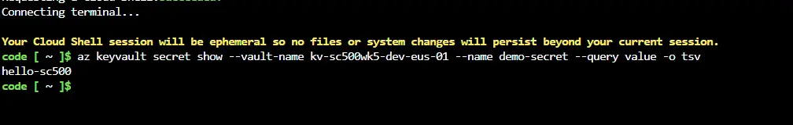

## Step 3 - Lock the firewall, then lock yourself out

**Networking > Firewalls and virtual networks > Allow public access from specific virtual networks and IP addresses**, then **Add your client IP address**. This flips the default action to Deny while letting your address through. Use your public address, which [ipchicken.com](https://ipchicken.com) will tell you.

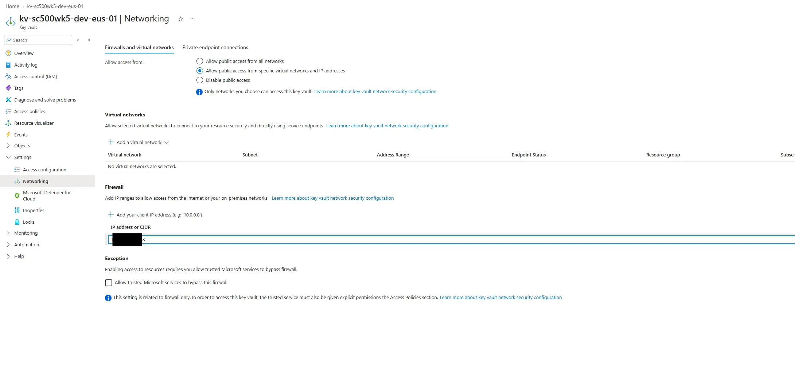
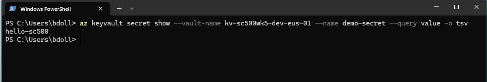

Now delete your IP from the list and apply. Nothing matches, the default is Deny, and the read fails.

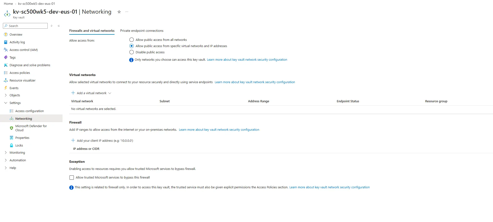
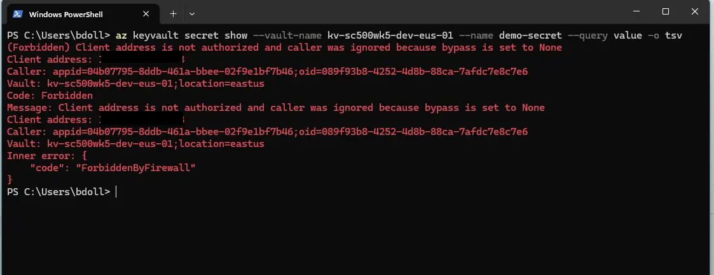

Both refusals are HTTP 403, but the inner code differs and so does the reason:

| Step | Code | Meaning |
|---|---|---|
| 2, no data-plane role | `Forbidden` | The vault knows who you are and refuses |
| 3, role present, IP blocked | `ForbiddenByFirewall` | The vault refuses before it checks who you are |

Same account, same role, same operation. Only the network rule changed. One is "your identity can't," the other is "your network can't."

## Step 4 - Private endpoint and split-horizon DNS

Build a VNet `10.20.0.0/16` with two subnets: `snet-pe` (`10.20.1.0/24`) for the endpoint and `snet-vm` (`10.20.2.0/24`) for a test VM. The VM would resolve the vault privately from either subnet, since the private DNS zone links at the VNet level, but endpoints get their own subnet by convention so NSGs and route tables stay scoped to them.

Create a private endpoint against the **vault** sub-resource into `snet-pe`, and let the wizard create and link `privatelink.vaultcore.azure.net`. That last part is the step people skip, and without it resolution never changes and the endpoint looks broken.

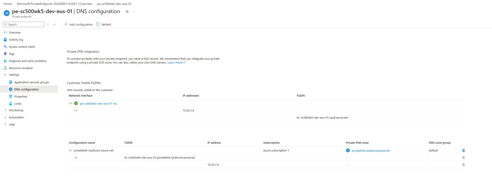

Deploy an Ubuntu VM into `snet-vm` with no public IP and no inbound rules. You reach it through **Run command**, which flows over the control plane rather than the network, so the VM needs no connectivity of its own.

```bash
getent hosts kv-sc500wk5-dev-eus-01.vault.azure.net
```

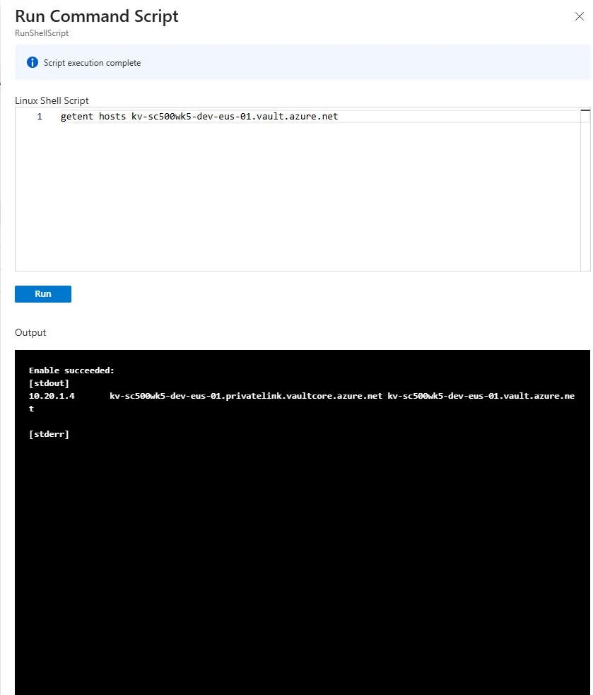

It returns `10.20.1.x`. (`getent` is built in; `nslookup` needs `dnsutils`, which this VM cannot reach without outbound internet.) Run the same lookup from your own workstation:

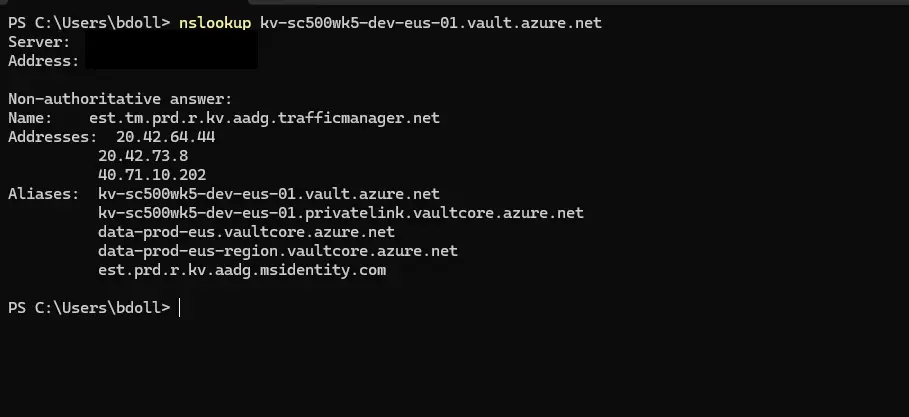

A public address. Same hostname, two answers, depending on whether the asking client's VNet is linked to the private zone. That split is the entire point of a private endpoint.

## Step 5 - A custom policy with a Deny effect

There *is* a built-in for this, "Key vaults should have deletion protection enabled," but it ships as `Audit`. The objective names custom definitions, so author one that denies.

**Policy > Authoring > Definitions > Policy definition**, location set to your subscription, category **Key Vault**:

```json
{
  "policyRule": {
    "if": {
      "allOf": [
        { "field": "type", "equals": "Microsoft.KeyVault/vaults" },
        {
          "anyOf": [
            { "field": "Microsoft.KeyVault/vaults/enablePurgeProtection", "exists": "false" },
            { "field": "Microsoft.KeyVault/vaults/enablePurgeProtection", "equals": "false" }
          ]
        }
      ]
    },
    "then": { "effect": "deny" }
  }
}
```

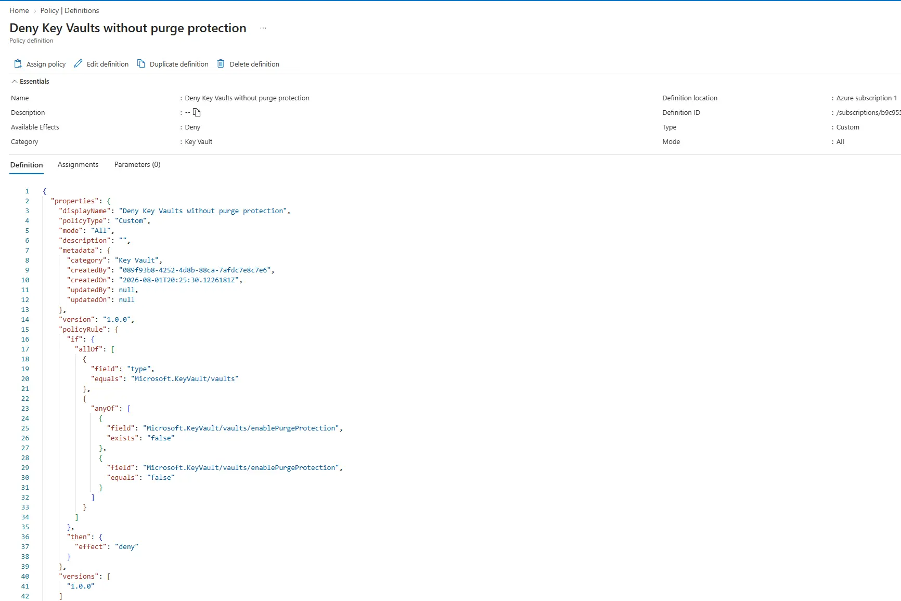

> **The portal and the CLI want different shapes.** The portal box needs the `policyRule` wrapper above; the CLI `--rules` file wants the bare `if`/`then` without it. Pasting the CLI shape into the portal gives `Could not find member 'if' ... Path 'properties.if'`, and the reverse leaves the CLI unable to find the rule.

Assign it with the scope set to the resource group. **Allow up to 15 minutes before it starts denying.** If the next step succeeds when it should not, you tested too early. This burns more lab time than anything else here.

## Step 6 - Watch it block a deployment

Create a second vault with purge protection left at its default (off). Validation fails.

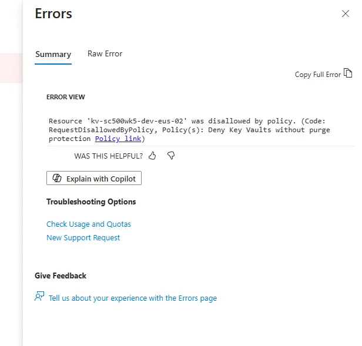

Re-run the same create with purge protection enabled and it succeeds. Same target, same scope, one setting.

## Cleanup

Delete the policy assignment and definition *before* the resource group, since an assignment scoped to a deleted group is orphaned and annoying to find later. Then delete the group.

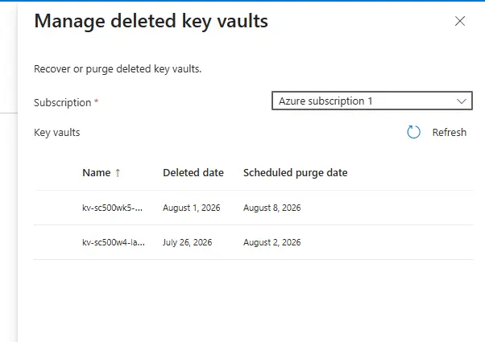

Both vaults enter soft-delete for 7 days and cannot be purged early. `az keyvault list-deleted` shows them and their names stay reserved. That is the control working, not a failure.

## Key takeaways

- Three independent layers can refuse a secret read, and the error string says which one did. `ForbiddenByRbac` is identity; `ForbiddenByFirewall` is network, and it is evaluated first, before the vault cares who you are.
- Subscription Owner is control plane. It can delete the entire vault and cannot read one secret out of it.
- Secrets User reads, Secrets Officer writes, Reader sees names but not values, Contributor manages the vault but never its contents.
- Soft delete is mandatory and cannot be turned off. Purge protection is optional, off by default, and irreversible once on.
- A private endpoint changes *where* a name resolves, not the name. The answer depends on whether the client's VNet is linked to the private DNS zone.
- Built-ins often ship as `Audit`. Authoring the same check with `Deny` is what turns detection into prevention, and assignments take up to 15 minutes to bite.

## Related labs

- [Secretless VM: Managed Identity, Bastion, and Key Vault]() approaches the same vault from the workload side
- [Lock Down a Storage Account End-to-End]() is the same private endpoint pattern on storage
- [Custom RBAC Role + Azure Policy + Resource Lock]() covers the policy engine and built-in definitions
