+++
title = "Secretless VM: Managed Identity, Bastion, and Key Vault"
date = 2026-07-26T16:15:00-04:00
draft = false
description = "Build a VM with no public IP, no inbound rules, and no credentials on disk, then have it authenticate to Key Vault with only its managed identity and prove the read landed in audit logs."
tags = ["azure", "managed-identity", "key-vault", "bastion", "log-analytics", "sc-500"]
categories = ["labs"]
aliases = ["/writeups/labs/secretless-vm-managed-identity-key-vault/"]
+++

Part of my SC-500 study series: hands-on labs in a test tenant, one concept at a time.

**Goal:** Build a VM with no public IP, no inbound NSG rules, and no credentials on disk, then have it authenticate to Key Vault and pull a secret using only its system-assigned managed identity. Finish by proving the retrieval landed in Key Vault audit logs in a resource-specific Log Analytics table.

## Why this matters

"Secretless" is three separate wins stacked together:

1. **No inbound exposure.** No public IP and no RDP/SSH rule means no internet-facing attack surface. Access comes through Bastion, which terminates the session in Azure.
2. **No stored credentials.** A system-assigned managed identity is an Entra service principal tied to the VM's lifecycle. The VM asks IMDS at `169.254.169.254` for a token. Nothing on disk, nothing to rotate.
3. **Platform integrity.** Trusted Launch (Secure Boot plus vTPM) protects the boot chain underneath both.

Each layer fails independently, so you can see which one rejected you.

## Prerequisites

- Owner or Contributor plus User Access Administrator on the subscription
- Azure CLI installed locally and logged in with `az login`
- A region where the Bastion Developer SKU is available (otherwise use Basic and budget for it)

## Step 0 - Read this first: outbound internet

> **The gotcha that will eat your session if you skip it.** Default outbound internet access for VMs with no public IP has been retired. A VM with no public IP, no NAT gateway, and no firewall has **no outbound internet path**, which breaks installing the Azure CLI and reaching `login.microsoftonline.com` and the Key Vault data plane. IMDS (`169.254.169.254`) is link-local and served by the host fabric, so token acquisition still works. Everything after the token does not.

This lab uses a **NAT Gateway**: one resource, outbound-only, no inbound path. A private endpoint for Key Vault is the more secure design, but you still need a path to install the CLI, so that is a second pass. See the variant at the end.

## Step 1 - Resource group, VNet, and subnet

Create the resource group `rg-sc500w4-lab-eastus-001`, then a VNet `vnet-sc500w4-lab-eastus-001` with address space `10.10.0.0/16`.

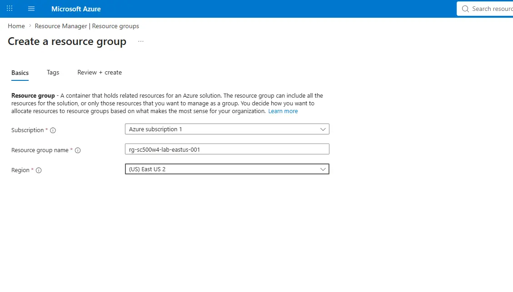

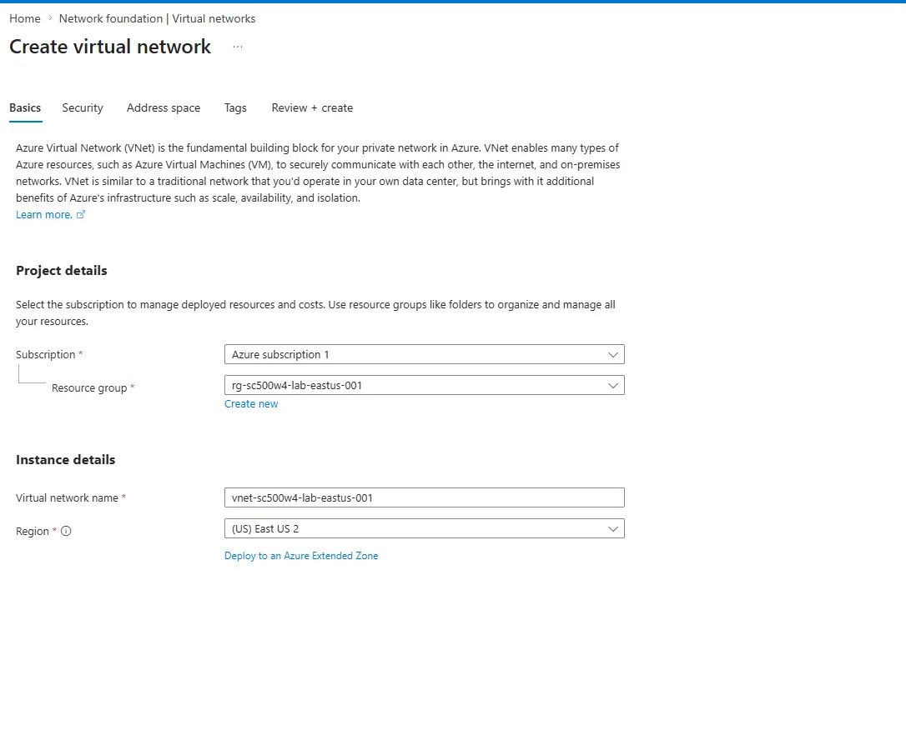

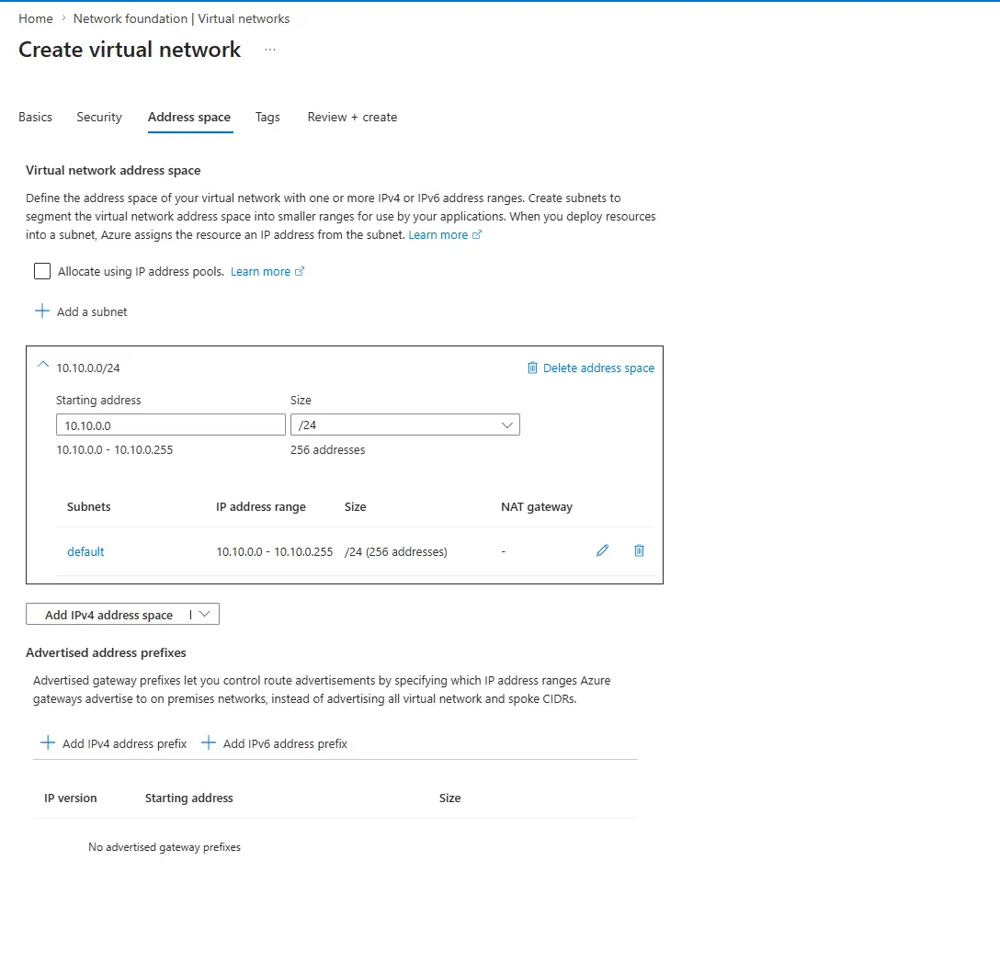

The wizard pre-creates a subnet named `default` on the **IP addresses** tab. Subnets cannot be renamed, so set the name there, or delete `default` afterward and add this one:

| Setting | Value |
|---|---|
| Subnet purpose | Default |
| Name | `snet-sc500w4-lab-eastus-001` |
| IPv4 address range | `10.10.0.0/24` |
| Enable private subnet (no default outbound access) | **Checked** |
| NAT gateway, NSG, route table, service endpoints, delegation | None |

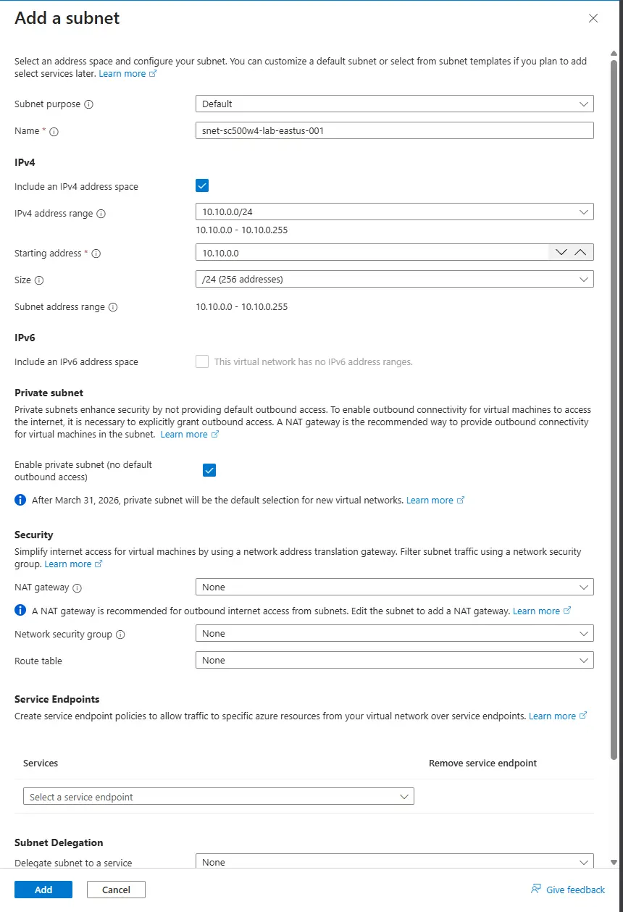

**Enable private subnet** is Step 0's problem as a checkbox: no implicit outbound path, so the VM gets one only from Step 2.

```bash
az network vnet subnet create -g rg-sc500w4-lab-eastus-001 --vnet-name vnet-sc500w4-lab-eastus-001 -n snet-sc500w4-lab-eastus-001 --address-prefix 10.10.0.0/24 --default-outbound false
```

## Step 2 - NAT Gateway for outbound

**Basics.** The region must match the VNet's, or the VNet will not appear on the Subnet tab. Availability zone **No Zone**; a zonal gateway needs a public IP in the same zone and cannot be changed later. Idle timeout 4 minutes.

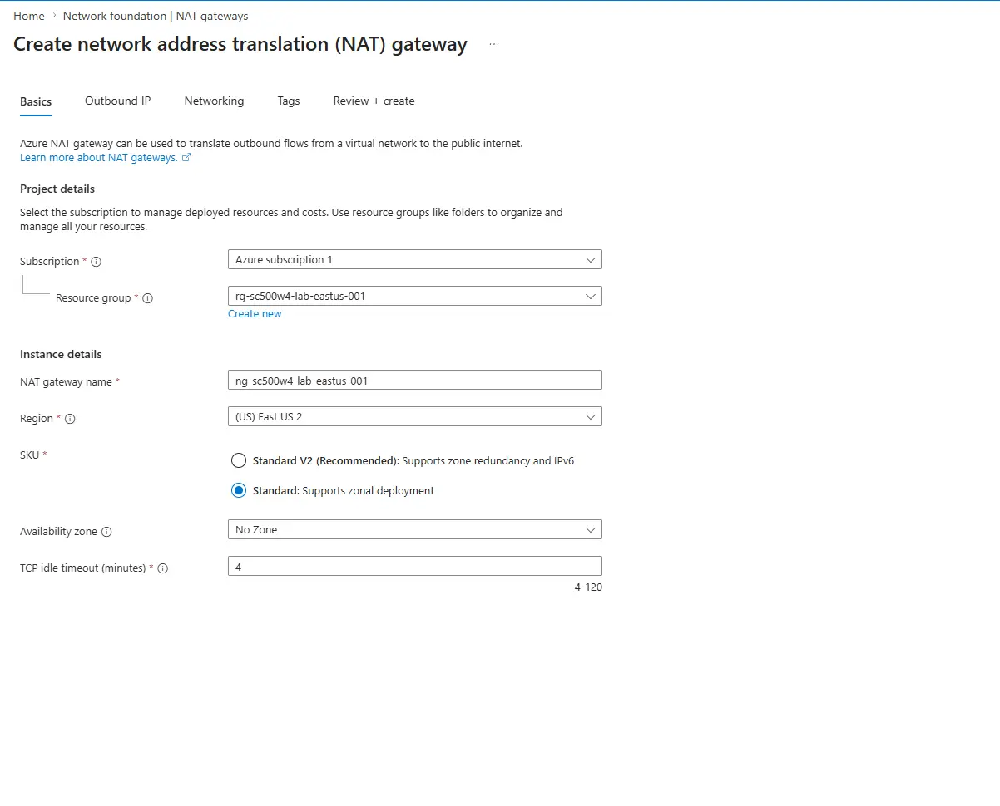

**Outbound IP.** Create a new public IP named `pip-sc500w4-nat-eastus-001`. The SKU is locked to Standard and Static, so a pre-created Basic IP will not appear in the dropdown.

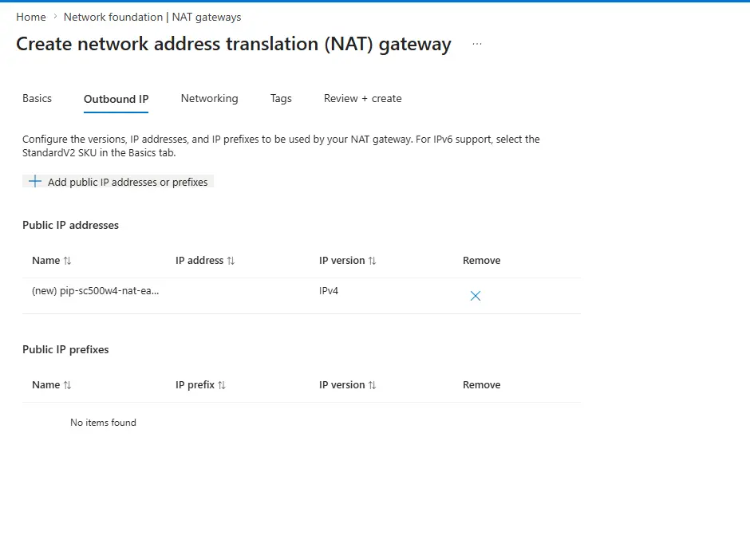

**Subnet.** Select the VNet and tick only `snet-sc500w4-lab-eastus-001`.

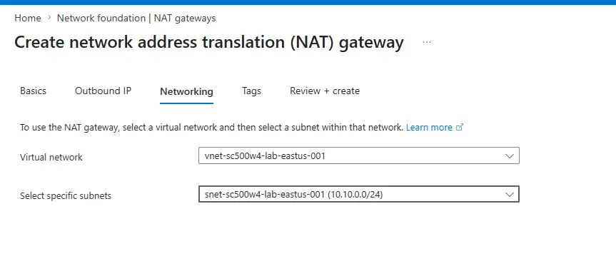

### Verify the association

The gateway looks healthy whether or not the association took, and a miss does not surface until the CLI install hangs in Step 7. Check from the subnet side instead: VNet → **Subnets** → the workload subnet → **NAT gateway** shows `ng-sc500w4-lab-eastus-001`.

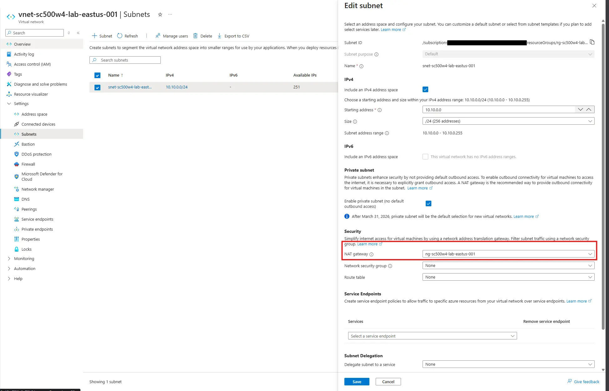

```bash
az network vnet subnet update -g rg-sc500w4-lab-eastus-001 --vnet-name vnet-sc500w4-lab-eastus-001 -n snet-sc500w4-lab-eastus-001 --nat-gateway ng-sc500w4-lab-eastus-001
```

## Step 3 - Deploy the VM with Trusted Launch and a managed identity

| Tab | Setting | Value |
|---|---|---|
| Basics | Image | Ubuntu Server LTS **Gen2** |
| Basics | Security type | **Trusted launch virtual machines** |
| Basics | Authentication type | **Password** (or SSH public key, see the note below) |
| Basics | Public inbound ports | **None** |
| Networking | Virtual network / subnet | the ones from Step 1 |
| Networking | Public IP | **None** |
| Networking | NIC NSG | Basic → None, or a default NSG with no inbound allow rules |
| Management | Identity | **Enable system assigned managed identity** = On |

Trusted Launch requires Gen2. If the dropdown will not offer it, the image is Gen1.

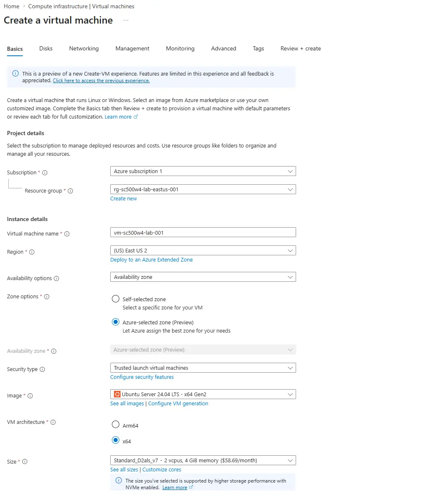

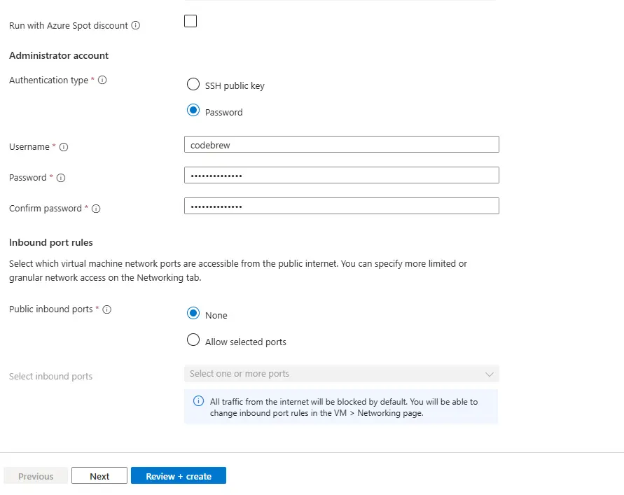

> **Why a password on a "secretless" VM?** The admin credential never crosses the internet and the workload never uses it. There is no inbound path to this VM at all, so the only way in is Bastion, which authenticates you against Entra first and terminates the session inside Azure. "Secretless" here means the VM holds no credential for **Key Vault**: that job belongs to the managed identity in Step 7. An SSH key pair works identically, and Bastion accepts either.

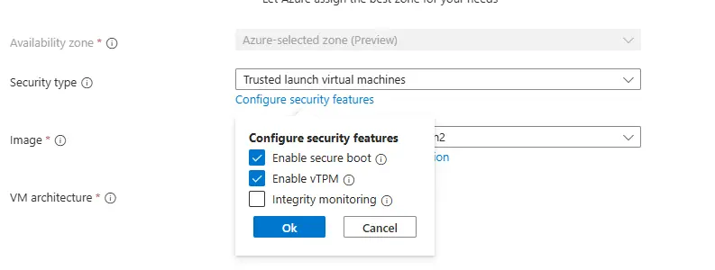

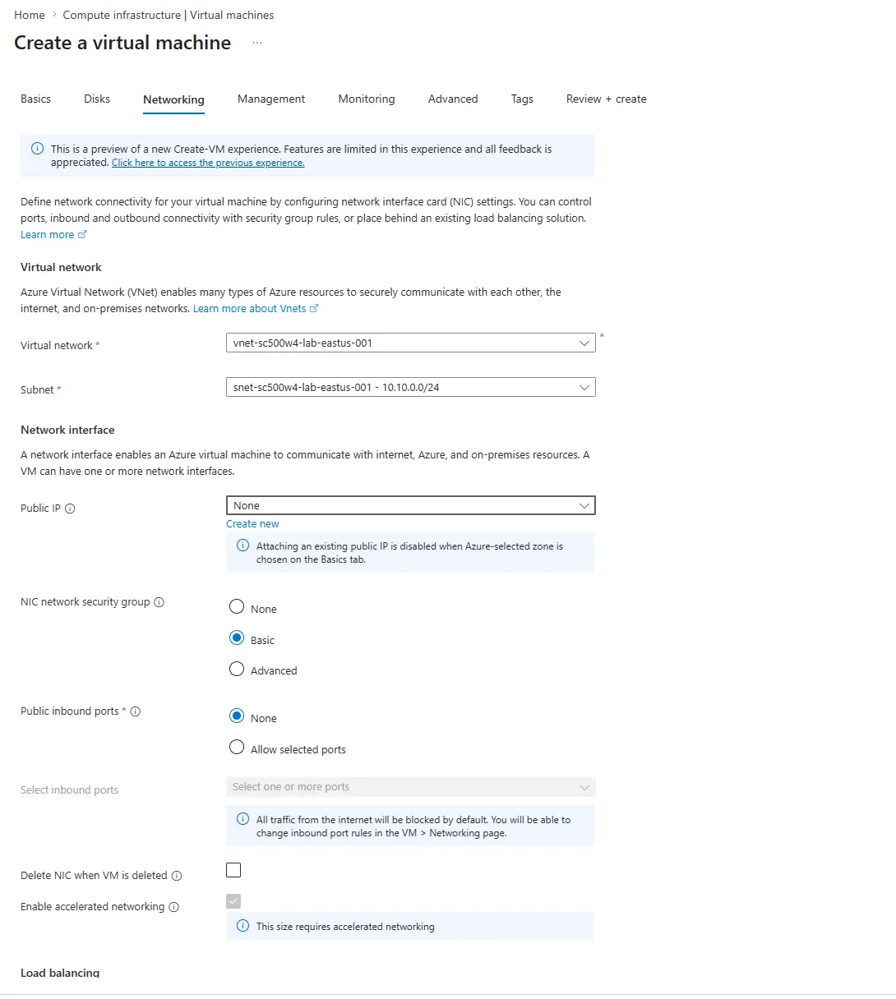

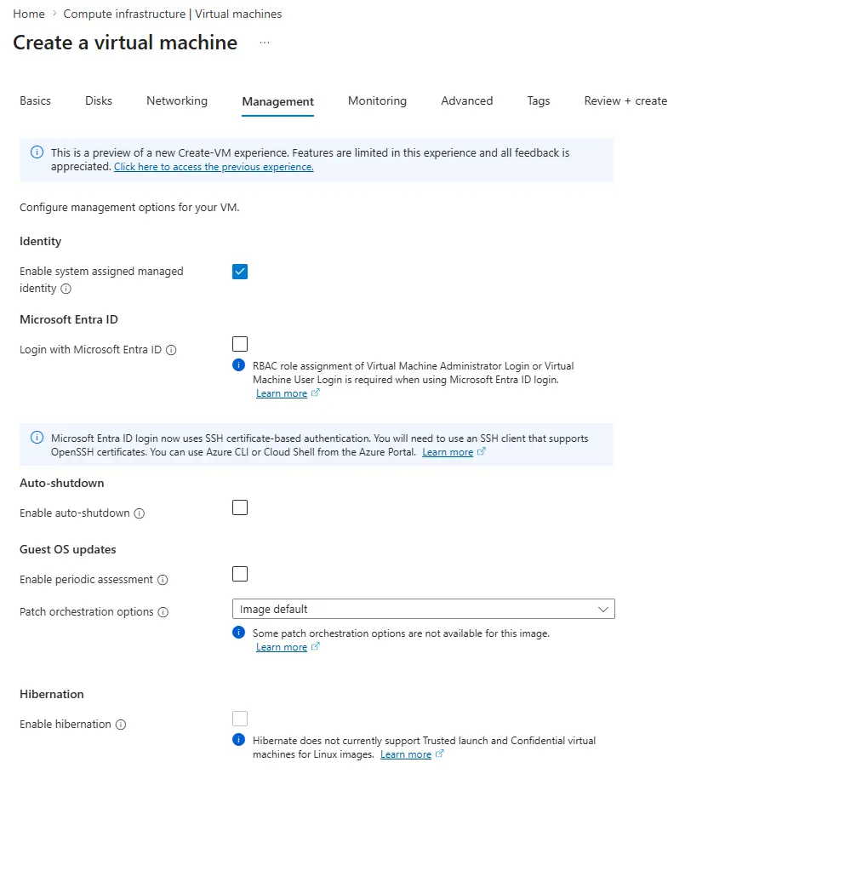

```bash
az vm show -g rg-sc500w4-lab-eastus-001 -n vm-sc500w4-lab-001 --query securityProfile
```

### Verify the VM has no public IP

The Overview blade's **Public IP address** field shows the NAT gateway's address, annotated with the gateway name. That is the subnet's shared SNAT address, not one on this VM.

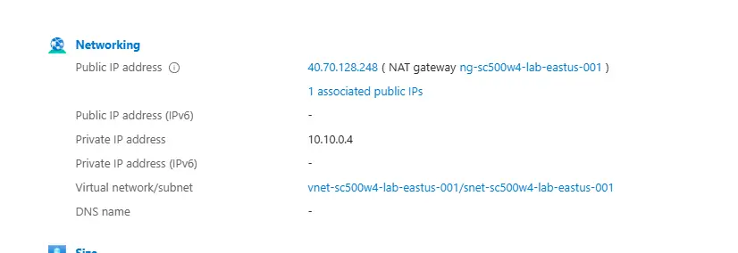

The NIC is authoritative: VM → **Networking** → **Network settings** → the IP configuration shows **Public IP address** as empty. Empty output below means the same.

```bash
az vm show -d -g rg-sc500w4-lab-eastus-001 -n vm-sc500w4-lab-001 --query publicIps -o tsv
```

Copy the principal ID for Step 5, also visible at VM → **Identity** → **Object (principal) ID**:

```bash
az vm identity show -g rg-sc500w4-lab-eastus-001 -n vm-sc500w4-lab-001 --query principalId -o tsv
```

## Step 4 - Create the Key Vault and a test secret

| Setting | Value |
|---|---|
| Key vault name | `kv-sc500w4-lab-001` (globally unique) |
| Pricing tier | Standard |
| Days to retain deleted vaults | 7 |
| Purge protection | **Disable** |

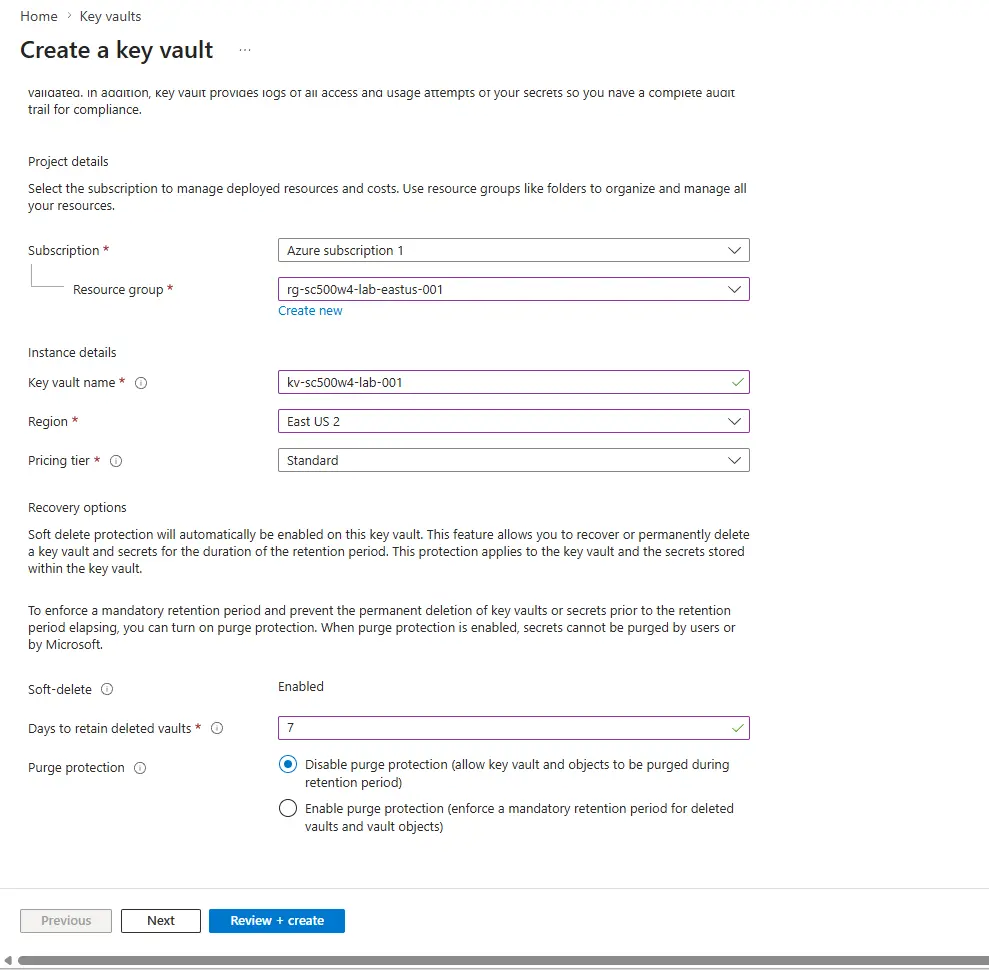

> **Purge protection is irreversible and blocks cleanup.** Once on it cannot be turned off for the life of the vault, and it prevents permanent deletion until the retention period elapses. `az group delete` then leaves the vault name reserved for up to 90 days. Soft delete cannot be disabled at all, and 7 days is the minimum.

**Access configuration.** Choose **Azure role-based access control**, not Vault access policy. RBAC means permissions come from role assignments with normal scope inheritance, which is why Steps 4 and 5 both need explicit ones.

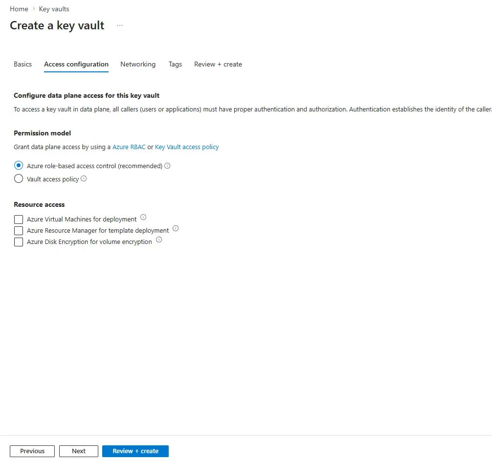

**Networking.** Leave public access enabled. The VM reaches the vault through the NAT gateway.

### Grant yourself data-plane access

Creating the vault does not let you read what is inside it. Vault → **Access control (IAM)** → **Add role assignment** → **Key Vault Secrets Officer** → your account. Propagation takes a minute or two.

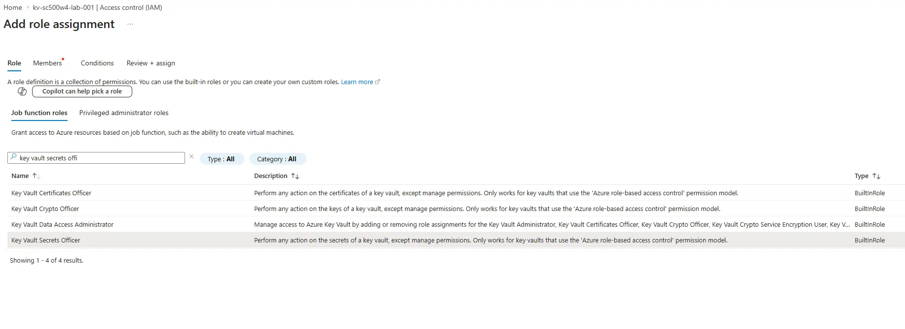

> **Try creating the secret before the role assignment.** As subscription Owner you get a data-plane `Forbidden`. Owner is control plane: it can delete the whole vault but not read one secret out of it. Best screenshot in this step.

### Create the secret

Vault → **Objects** → **Secrets** → **Generate/Import**. Upload options **Manual**, name `lab-secret`, any recognizable value. Note the value, because you match it on the VM in Step 7.

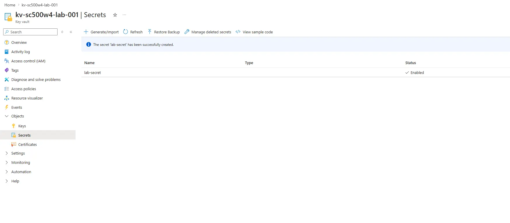

## Step 5 - Grant the VM's identity access

Vault → **Access control (IAM)** → **Add role assignment** → **Key Vault Secrets User**.

| Role | Grants | Plane |
|---|---|---|
| Key Vault Secrets User | read secret **values** | data |
| Key Vault Secrets Officer | full CRUD on secrets | data |
| Key Vault Reader | metadata and secret names, **not** values | data |
| Key Vault Administrator | full data-plane on keys, secrets, certificates | data |
| Key Vault Contributor | manage the vault resource, **no** access to contents | control |

On the **Members** tab choose **Managed identity** → **Select members** → **Virtual machine** → `vm-sc500w4-lab-001`. The identity does not appear under "User, group, or service principal".

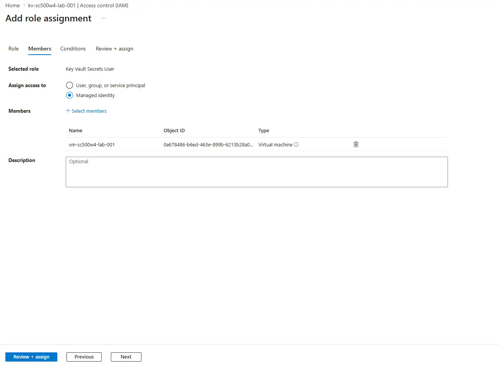

Verify on the **Role assignments** tab: the VM appears with Key Vault Secrets User, object ID matching Step 3.

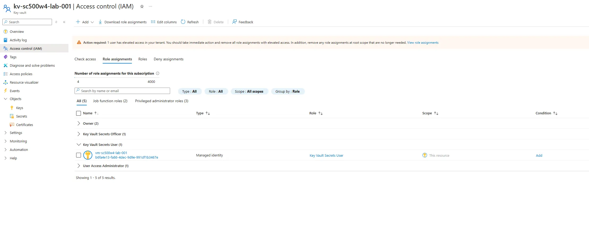

Your account writes secrets. The VM only reads them.

## Step 6 - Connect through Bastion

VM → **Connect** → **Bastion**. The Developer SKU is a shared regional service: no `AzureBastionSubnet`, no Bastion public IP in your VNet, no charge. If it is not offered in your region, Basic needs a subnet named exactly **AzureBastionSubnet** at /26 or larger plus a standard public IP, billed hourly.

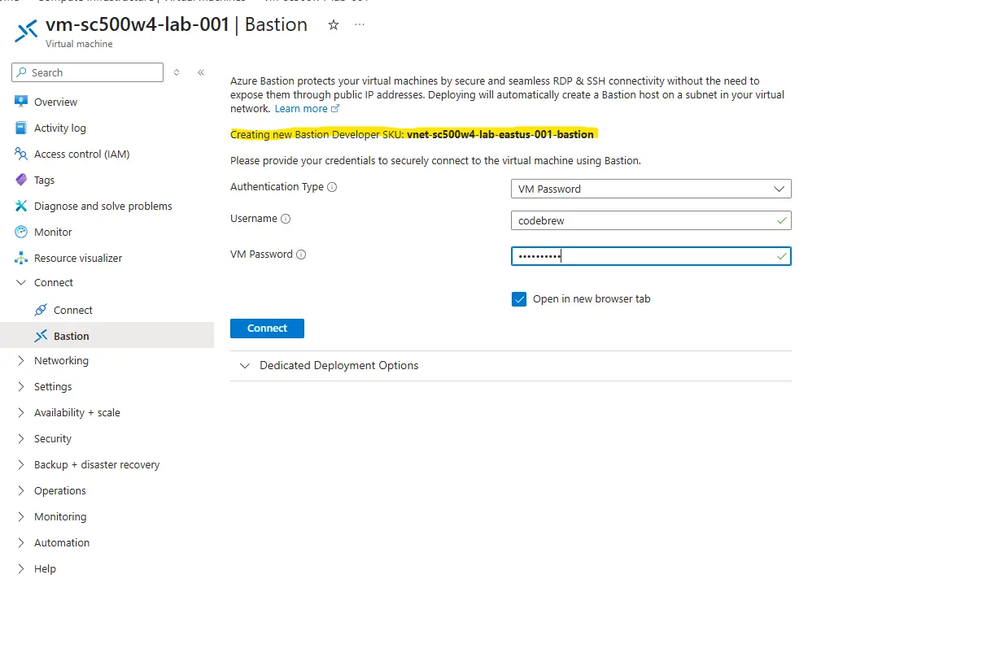

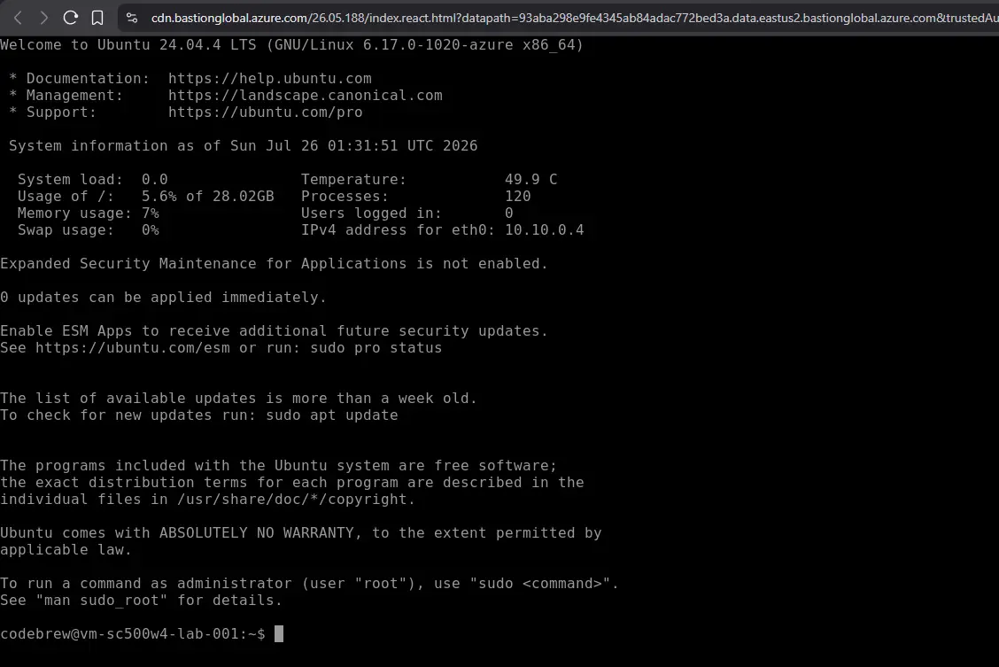

```bash
ip -4 addr show
```

Only the private `10.10.0.x` address, and you are still on the box.

## Step 7 - Pull the secret with the managed identity

Ask IMDS for a token scoped to Key Vault:

```bash
curl -s -H "Metadata: true" "http://169.254.169.254/metadata/identity/oauth2/token?api-version=2018-02-01&resource=https%3A%2F%2Fvault.azure.net"
```

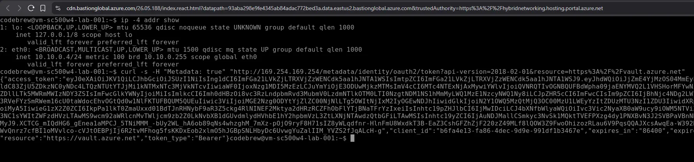

Paste the JWT into [jwt.ms](https://jwt.ms) to see the `oid` claim match the VM's principal ID.

Install the CLI. This is the step that needs the NAT gateway:

```bash
curl -sL https://aka.ms/InstallAzureCLIDeb | sudo bash
```

```bash
az login --identity
```

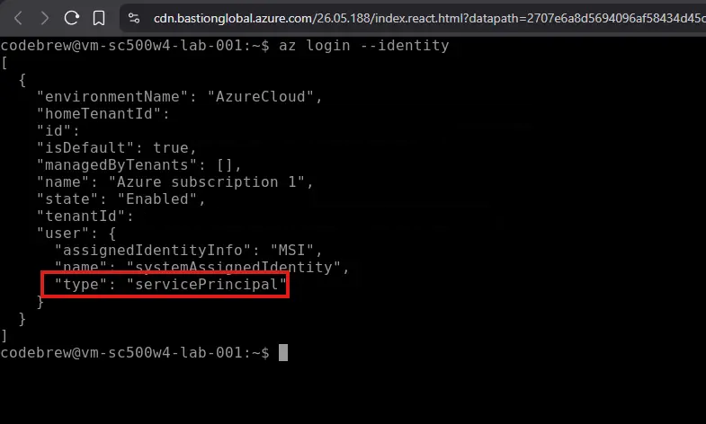

```bash
az keyvault secret show --vault-name kv-sc500w4-lab-001 -n lab-secret --query value -o tsv
```

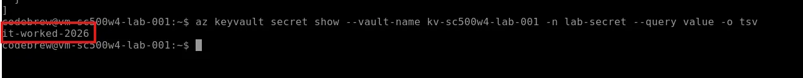

No password typed, no key file copied, no service principal secret anywhere.

### Negative test

Remove the **Key Vault Secrets User** assignment, wait a minute or two, then re-run the read in the session you already have.

`Forbidden`, with `"code": "ForbiddenByRbac"`. In the error body, `Caller` names the VM's identity by `oid`, which Key Vault could only resolve from a valid token, and `Assignment: (not found)` shows the failure was authorization, not authentication.

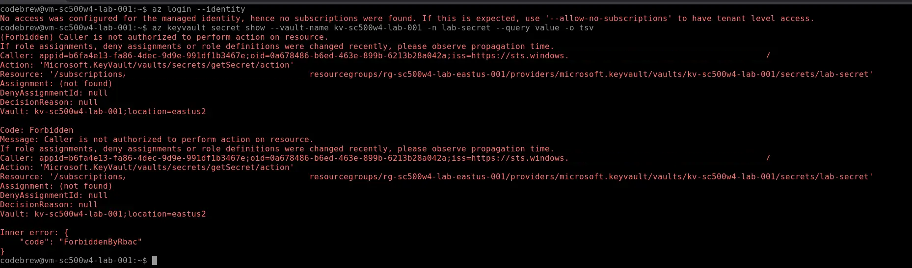

IMDS still issues a token with the role gone, since token issuance involves no RBAC:

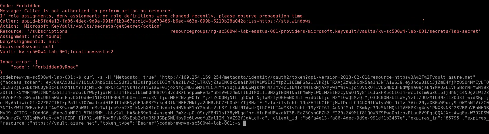

Stay in the existing session rather than re-running `az login --identity`, which reports "no subscriptions found" once the identity has no role assignments to enumerate. Re-add the role before Step 8.

## Step 8 - Key Vault audit logs to Log Analytics

### 8a - Create the Log Analytics workspace

Resource group `rg-sc500w4-lab-eastus-001`, name `law-sc500w4-lab-eastus-001`, same region as the vault. That is the whole blade. Pricing tier and retention default correctly and are changed later under **Usage and estimated costs**.

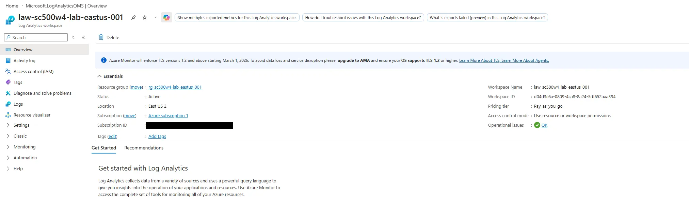

### 8b - Point a diagnostic setting at it

The setting lives on the source resource. The workspace has no list of what logs into it.

| Setting | Value |
|---|---|
| Diagnostic setting name | `diag-sc500w4-lab-eastus-001` |
| Logs | **Audit Logs** under *Categories* |
| Metrics | leave AllMetrics unchecked |
| Destination | Send to Log Analytics workspace |

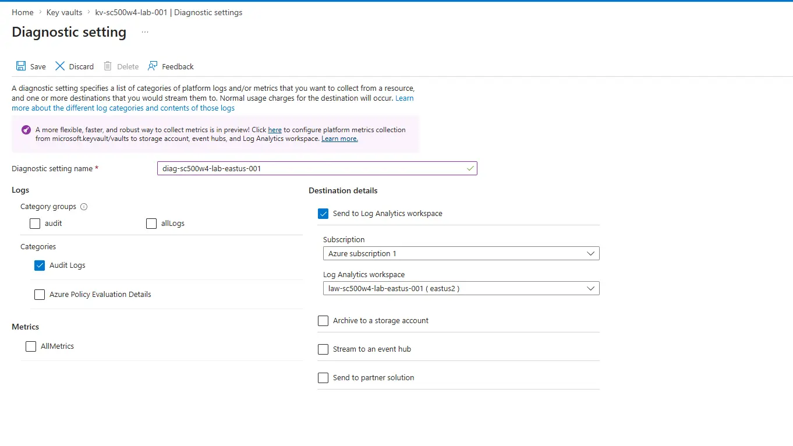

Tick the specific **Audit Logs** category rather than the `allLogs` or `audit` category groups, whose membership changes over time. The API name for it is `AuditEvent`.

> **Create this from the CLI, not the portal.** The **Destination table** selector that chooses resource-specific mode is frequently absent from this blade for Key Vault, and saving without it defaults to legacy mode: events land in `AzureDiagnostics`, `AZKVAuditLogs` is never created, and the symptom is an empty table half an hour later.

```bash
az monitor diagnostic-settings create --name diag-sc500w4-lab-eastus-001 --resource "$(az keyvault show -g rg-sc500w4-lab-eastus-001 -n kv-sc500w4-lab-001 --query id -o tsv)" --workspace "$(az monitor log-analytics workspace show -g rg-sc500w4-lab-eastus-001 -n law-sc500w4-lab-eastus-001 --query id -o tsv)" --export-to-resource-specific true --logs '[{"category":"AuditEvent","enabled":true}]'
```

Confirm the mode before waiting on ingestion. `Dedicated` is resource-specific, empty is legacy:

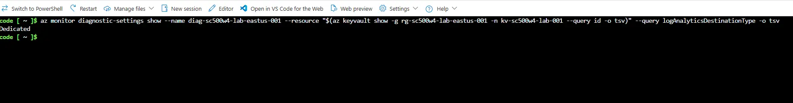

### 8c - Generate traffic and query

Diagnostic settings are not retroactive, so generate fresh reads from the VM, run them several times, then wait. Ingestion is 5 to 15 minutes, slower on a new workspace, and `AZKVAuditLogs` will not appear in the schema browser until the first rows land.

```kusto
AZKVAuditLogs
| where OperationName == "SecretGet"
| project TimeGenerated, HttpStatusCode, CallerIpAddress,
          oid = tostring(Identity.claim.oid),
          appid = tostring(Identity.claim.appid),
          callerVm = tostring(Identity.claim.xms_mirid)
| order by TimeGenerated desc
```

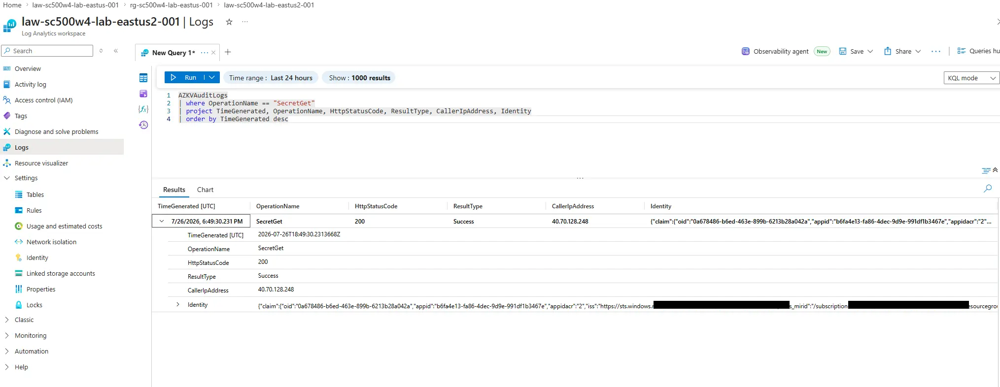

`oid` matches the principal ID from Step 3 and the `oid` claim from the JWT in Step 7, and `xms_mirid` is the calling VM's full resource ID. `CallerIpAddress` is the NAT gateway's address, since the request arrives SNAT'd.

Confirm the routing choice. Empty is correct:

```kusto
AzureDiagnostics
| take 10
```

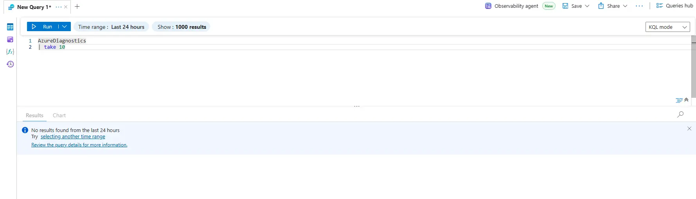

### 8d - The negative test, logged

Remove the **Key Vault Secrets User** assignment again, attempt the read from the VM, then query again. The denied attempt appears as `HttpStatusCode` **403** beside the earlier **200** rows: same identity, same operation, different outcome. Re-add the role afterward.

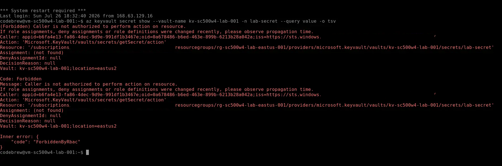

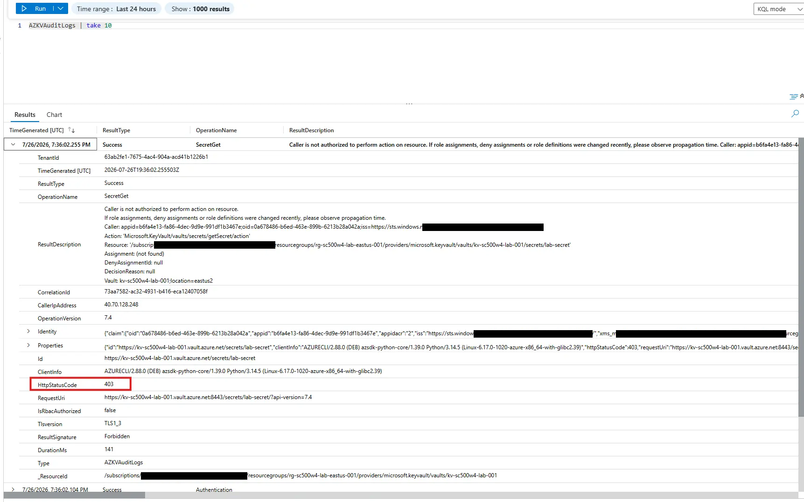

> **If no data arrives:** wait the full 30 minutes, since first-time ingestion is genuinely slow; remember the setting is not retroactive, so generate new reads; confirm `az provider show -n Microsoft.Insights --query registrationState -o tsv` returns `Registered`; and query `AzureDiagnostics`, because if your rows are there the setting is in legacy mode and needs recreating with `--export-to-resource-specific true`.

## Cleanup

```bash
az group delete -n rg-sc500w4-lab-eastus-001 --yes --no-wait
```

Role assignments scoped to resources in the group go with it. Both the vault and the workspace soft-delete and hold their names, the vault for its retention period and the workspace for 14 days. Purge them if you plan to rebuild soon, workspace first.

To pause between sessions instead, deallocate the VM. A `sudo shutdown` inside the session leaves it **Stopped** with compute still billed; only `az vm deallocate` or the portal's Stop button reaches **Stopped (deallocated)**. Delete a Bastion Basic host if you deployed one, since it is usually the largest idle cost. Leave the NAT gateway and public IP, which are a few cents overnight.

## Variant: replace the NAT gateway with a private endpoint

Once the lab works, the more defensible architecture is worth a second pass:

1. Create a private endpoint for the vault (`vault` sub-resource) into the workload subnet, letting the portal create and link `privatelink.vaultcore.azure.net`.
2. Set the vault's public network access to **Disabled**.
3. Remove the NAT gateway from the subnet.
4. From the VM, `nslookup kv-sc500w4-lab-001.vault.azure.net` returns a private IP and `az keyvault secret show` still works with no internet path at all.

Same split-horizon DNS behavior as [Lock Down a Storage Account End-to-End](). Do it after the CLI is installed, since removing the NAT gateway removes package-install access too.

## Key takeaways

- Managed identity removes the credential, not the authorization decision. A `ForbiddenByRbac` error naming the caller's `oid` is proof of successful authentication, because only an authenticated request can be attributed.
- Key Vault in RBAC mode enforces control plane and data plane separately. Subscription Owner does not imply secret read access.
- No public IP is not the same as no internet, and inbound reachability is not the same as outbound connectivity. A VM behind a NAT gateway shows a public IP on its Overview blade while having none on its NIC.
- The Bastion Developer SKU has no `AzureBastionSubnet` and no public IP because it is a shared regional service. Basic and above deploy into your VNet and bill hourly.
- Resource-specific diagnostic mode is a routing choice made at configuration time. `AzureDiagnostics` staying empty is the proof you picked correctly.
- Diagnostic settings live on the source resource, are never retroactive, and record denials as well as successes. The `403` beside the `200` is most of their detection value.

## Related labs

- [Lock Down a Storage Account End-to-End]() for the private endpoint and split-horizon DNS pattern
- [Key Vault Defense in Depth and Policy Enforcement]() separates the three ways a vault can refuse you
- [Defender for Cloud Free Tier Review]() grades the resources this lab built
