+++
title = "Virtual Network Manager Security Admin Rules"
date = 2026-08-10T18:05:00-04:00
draft = false
description = "Prove a central security admin rule sits above a VM's own NSG: deny SSH from a network manager, watch it beat an explicit NSG allow, then flip Deny to Allow and watch control hand back."
tags = ["azure", "networking", "virtual-network-manager", "nsg", "network-watcher", "sc-500"]
categories = ["labs"]
aliases = ["/writeups/labs/vnet-manager-security-admin-rules/"]
+++

Part of my SC-500 study series: hands-on labs in a test tenant, one concept at a time.

**Goal:** Prove that an Azure Virtual Network Manager **security admin rule** sits above a VM's own NSG and cannot be overridden by the resource owner. Deny SSH centrally, watch it beat an NSG rule that explicitly allows SSH, then flip the action to Allow and watch enforcement hand control back.

## Why this matters

[NSG Priority Ordering + Network Watcher Verification]() answered "who wins when two NSG rules disagree." This is the harder version: who wins when two *different controls* disagree, and whether a resource owner can undo a central control from inside their own resource. It is the network twin of a resource lock beating Owner RBAC.

Security admin rules exist because the alternatives all fail. If the central team owns every NSG, enforcement works but does not scale. If app teams own theirs, nobody can enforce anything. If Azure Policy creates the NSGs, the central team gets *notified* when a rule changes but cannot *prevent* it. Security admin rules are enforced in the host fabric, above NSGs, and an app-team owner cannot see or edit them from the NSG blade at all.

The exam-relevant nuance is the three actions:

| Action | Effect | NSG still evaluated? |
|---|---|---|
| **Deny** | Blocks before NSGs see the traffic | No |
| **Allow** | Passes the traffic *down* to NSG evaluation | **Yes**, the NSG can still deny it |
| **Always Allow** | Forces it through | No, the NSG cannot deny |

"Allow" not being a hard allow is the trap.

## Prerequisites

- Contributor plus Network Contributor on the subscription, and the ability to scope a network manager to it
- Single region throughout. Security admin configs deploy **per region**, and the deploy must target the VNet's region or nothing happens
- Portal only is fine. The AVNM CLI lives in an extension (`az extension add --name virtual-network-manager`) and its nested JSON is genuinely fiddly

> **Nothing is enforced until you deploy.** Creating the manager, the network group, the config, the collection, and the rule changes nothing on the wire. The deploy is asynchronous: minutes to commit, then more before effective rules refresh. Unchanged effective rules almost always mean a missing or mis-targeted deployment.

> **The network manager meters until it is deleted.** Roughly $0.02/hour per managed VNet. Trivial as a rate, but it has no power state and no obvious "on," so deleting the VM does not stop it. Tearing down the VM is not tearing down the lab.

## Step 1 - VNet and a VM whose NSG allows SSH

Create `vnet-sc500w6-lab-eastus2-001` at `10.60.0.0/16` with one subnet at `10.60.0.0/24`, no NSG and no NAT gateway.

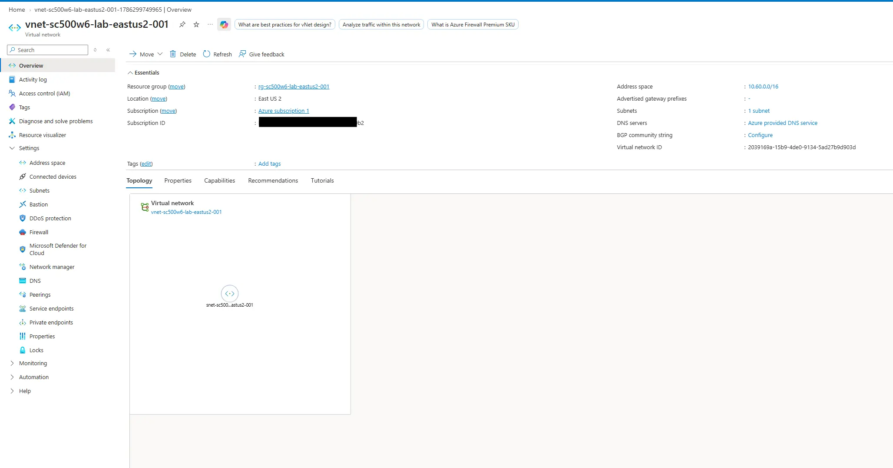

Deploy `vm-sc500w6-lab-001` into it with a public IP, SSH key auth, and public inbound ports set to **SSH (22)**. This is the app team's resource, configured the way they want it. That NSG allow is what the Deny will later beat, so confirm it exists.

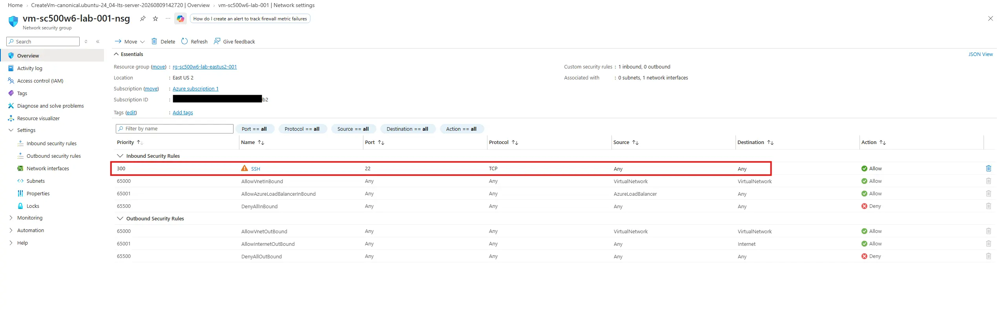

> **Watch the VM size.** The legacy B-series (`B1s`, `B2s`) is closed to newer subscriptions and auto-denies at deploy, and no quota request lifts it. `B2ls_v2` is the replacement, but fresh pay-as-you-go subscriptions often have the Bsv2 family capped at 0 with increase requests bouncing to `ContactSupport`. Check what you can actually deploy with `az vm list-usage --location eastus2 -o table | awk '$NF > 0'`.

SSH in from your machine to establish the baseline. The owner's NSG is doing exactly what they intend. Exit; the rest is control-plane.

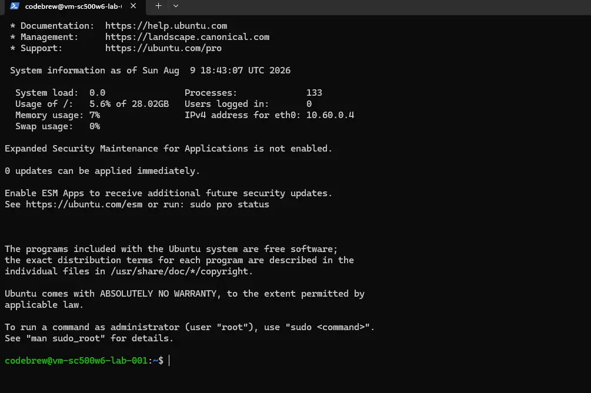

## Step 2 - Network manager and network group

Create `vnm-sc500w6-lab-eastus2-001`, ticking only the **Security admin** feature (leaving Connectivity off avoids those meters), with the management scope set to your subscription. Scope is the boundary of what the manager can govern: only VNets inside it are eligible for its network groups.

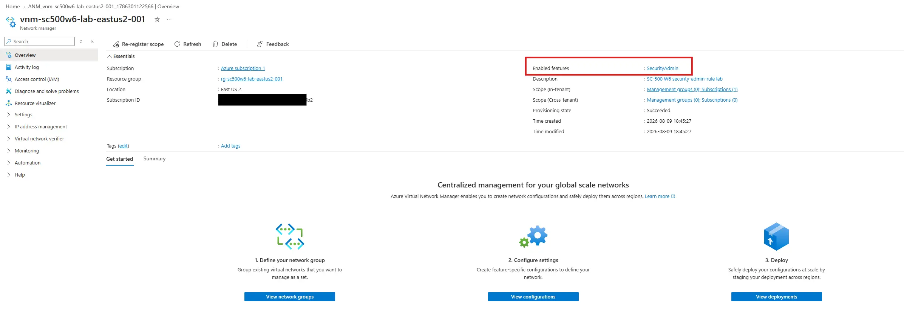

Add a network group `ng-sc500w6-servers-001` and add the lab VNet as a static member. If your VNet is missing from the picker, the scope above did not cover it.

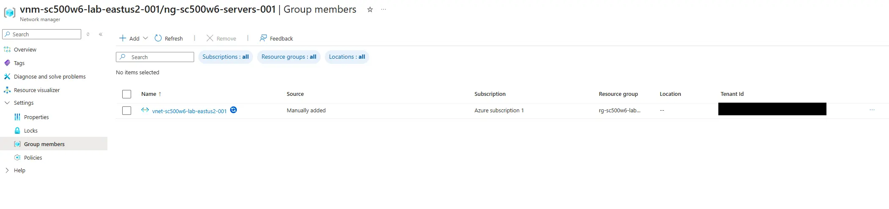

## Step 3 - Security admin config with a Deny rule

Create a security configuration `sac-sc500w6-lab-001`, a rule collection targeting the network group, and inside it a rule: **Deny**, **Inbound**, **TCP**, source Any, destination port **22**, priority 100.

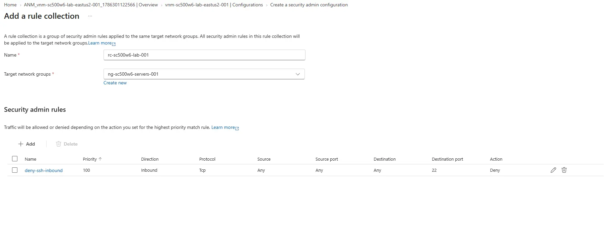

Priority orders rules *within* the security admin stage, lower first, exactly like NSGs. It does not compete with NSG priorities, because the two stages never share a number space.

Now deploy it, targeting the VNet's region. **This is the step that makes it real.**

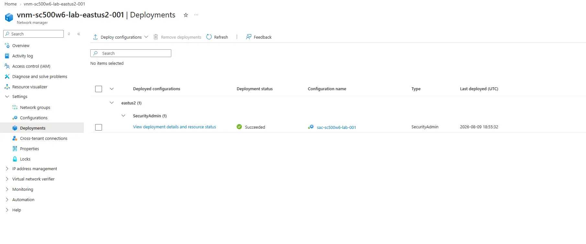

## Step 4 - Verify the rule sits above the NSG

The VM must be running for effective rules to compute. Go to the NIC's **Effective security rules**.

The view now has **two tabs**, one per source. The NSG tab looks completely normal, with the owner's allow-SSH untouched:

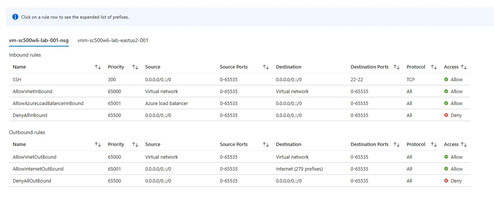

The network manager tab did not exist before the deploy, and there is the Deny:

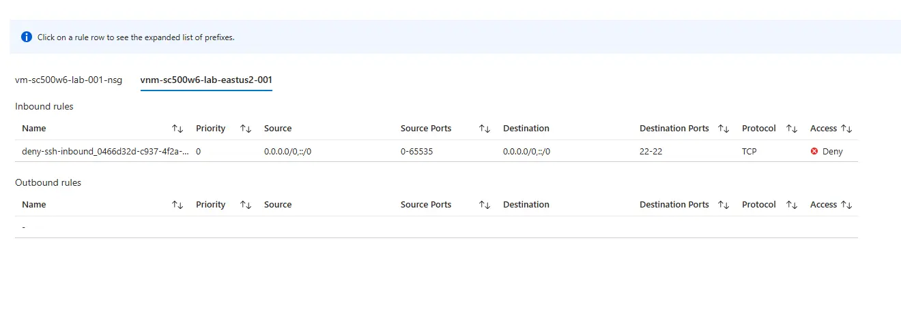

Two separate panes, not one merged list. That detail matters, because it is why the owner never sees the rule blocking them. SSH now hangs and times out: the Deny drops the SYN before the NSG's allow is consulted.

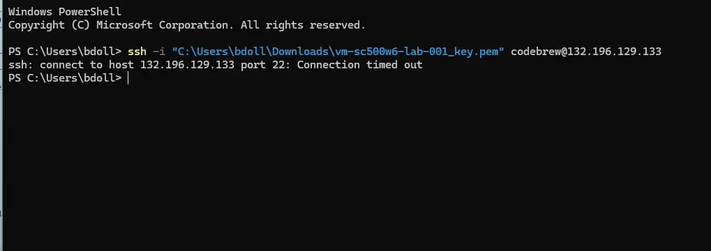

## Step 5 - The override attempt

Play the app-team owner trying to fix their broken SSH. Add the most aggressive allow an NSG permits: TCP 22 from Any, at priority 100.

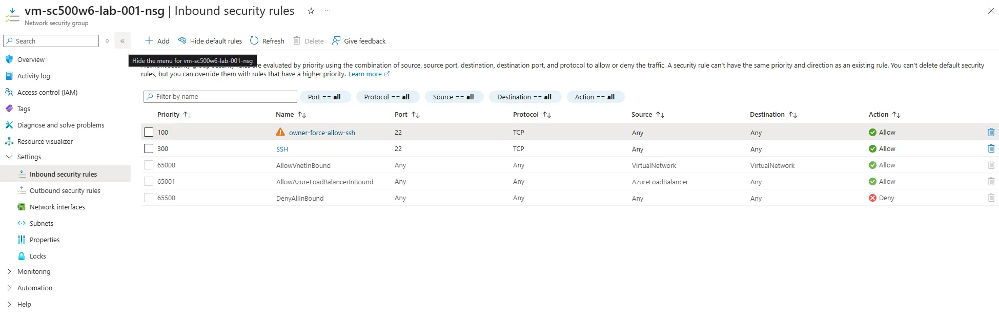

The NSG tab now looks like SSH should absolutely work. The manager's tab has not moved, because it was never the tab that decides:

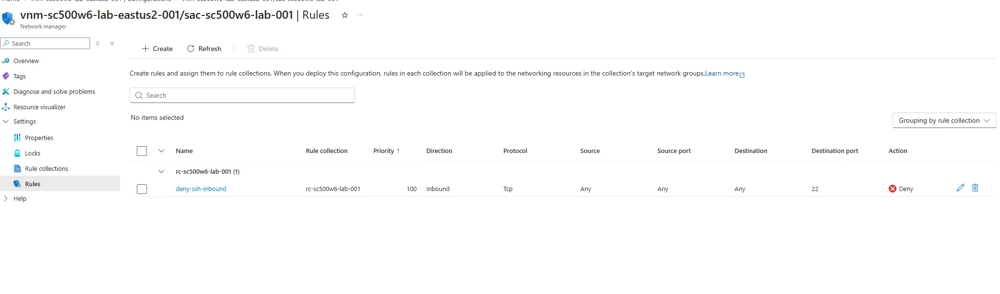

SSH still hangs. This is the whole point: the owner cannot override the Deny because, from where they sit, it is not even there to override.

## Step 6 - Flip Deny to Allow

Change the rule's action to **Allow** and **redeploy**. Edits are inert until redeployed, which is the one thing that caught me out on the first pass.

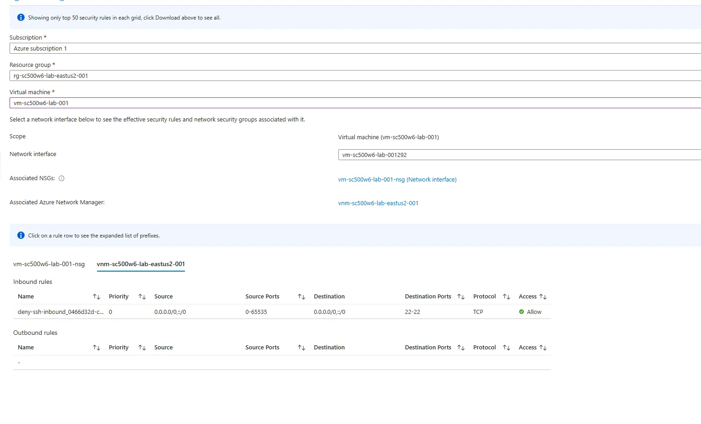

Because Allow defers to NSG evaluation, the NSG's allow-SSH is now reached and the connection works again.

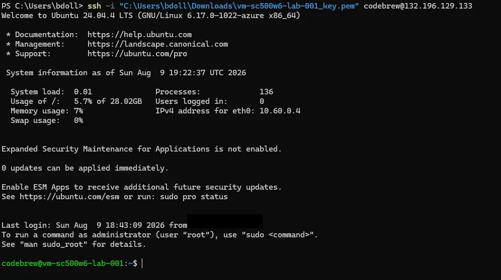

Worth recording without testing it: **Always Allow** would connect *even if the owner set the NSG to Deny 22*. Allow defers to the NSG, Always Allow forces through it, Deny blocks past it.

## Cleanup

Deallocate the VM, then delete the resource group. If the delete stalls on the network manager, the config is still deployed: remove the deployment first (commit a goal state with the config unselected for the region), then the config, network group, and manager. Portal delete flows now offer a force delete that does this for you. Confirm the manager is actually gone, since it is the thing that keeps metering.

## Variant worth knowing

Swap the static member for **dynamic membership** driven by an Azure Policy condition, such as VNets tagged `env=prod`. Any matching VNet, *including ones created after the rule is deployed*, joins the group and inherits the Deny with no further action. That automatic coverage is what makes security admin rules more than a fancy NSG, and it is a distinguishing exam detail even if you never build it.

## Key takeaways

- Security admin rules are evaluated in the host fabric before NSGs. A Deny stops evaluation, so the NSG allow behind it is never reached, and the owner cannot see or edit the rule from the NSG blade.
- The three actions are not symmetric. Deny blocks, Always Allow forces, and **Allow** only means "stop enforcing a block here and let the NSG decide."
- Effective security rules splits into one tab per source. Only the manager's tab shows the rule doing the blocking.
- Nothing is enforced until the config is deployed to the VNet's region, and edits need a fresh deploy.
- The network manager meters, has no power state, and a deployed config can block its own deletion.

## Related labs

- [NSG Priority Ordering + Network Watcher Verification]() is the intra-NSG version of "who wins"
- [Custom RBAC Role + Azure Policy + Resource Lock]() is the governance twin: a lock beating Owner RBAC is the same shape
- [Hub-Spoke Topology with VNet Peering]() for the multi-VNet topology these rules govern at scale
